# Feed Forward

1. **Perceptron - neural - LTU - TLU**  
   The perceptron is the simplest kind of artificial neural network — they're like the building blocks in neural networks.

   Each perceptron takes inputs and results in a threshold-dependent output.  
   Each input is multiplied by a weight that describes its importance before being fed to the perceptron. Without these weights, the model will have a hard time recognizing what actually matters.  
   At the perceptron, they are added together along with a bias (starting point).  
   The perceptron passes the result through an activation function to give the output.  
   If the output is > threshold, the perceptron decides a certain thing; if below, it decides another (this can be seen as a step function with 0 below the threshold and 1 above the threshold).

2. **Activation Functions**  
   Without them, the perceptron would draw a linear relation between inputs and outputs.  
   But this world would be messy, as data is usually complex with multiple parameters. These activation functions add the non-linearity needed by the data, letting the network bend, twist, and fold to draw an accurate relation between input and output.  
   It's just like how real data is better approximated using multiple powers of polynomials rather than one linear relation that would fail at multiple points.  
   Non-linearity is what makes deep networks powerful.

3. **Common Activation Functions**:  
   - **Sigmoid**:  
     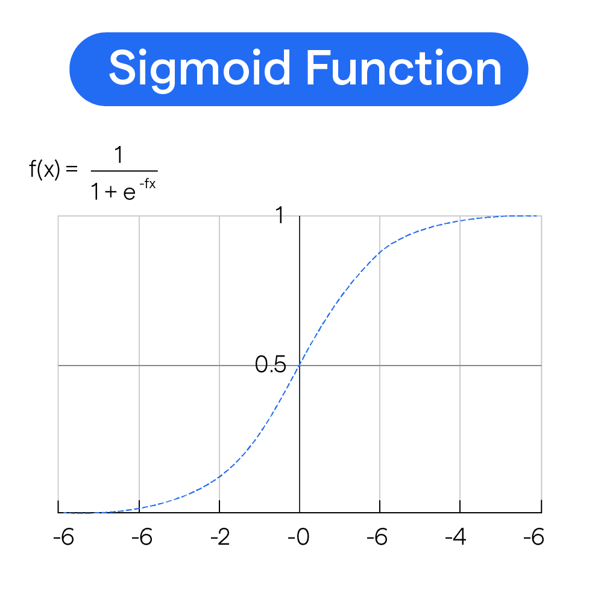  
     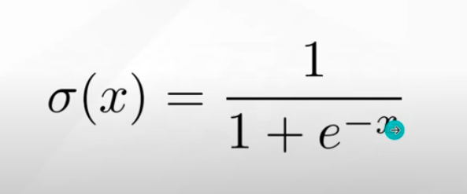  
     Computation is expensive due to exponential calculations.  
     Good for probabilities but can cause slow learning from large positive/negative inputs — best for binary classification tasks.  
     Output is between 0 and 1.

   - **Tanh**:  
     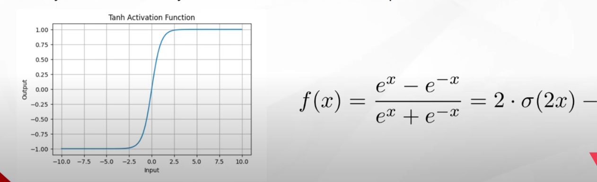  
     Like sigmoid but centered at 0.  
     Output ranges between -1 and 1.  
     Requires specific conditions and is computation expensive.

   - **ReLU**:  
     Lower computation cost, only a few neurons are activated at a time, making the network more efficient, as some neurons are not activated — outputs below the threshold are 0.  
     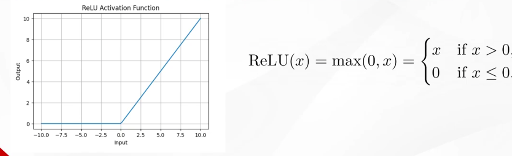  
     Not differentiable at 0, which is not accurately handled.  
     Output = 0 if input < 0 and = input if > 0.  
     Very fast and common in modern deep learning.  
     Avoids the "dead neuron problem."

   - **Softmax**:  
     Turns output into a probability distribution across classes (good for classification of multiple categories).  
     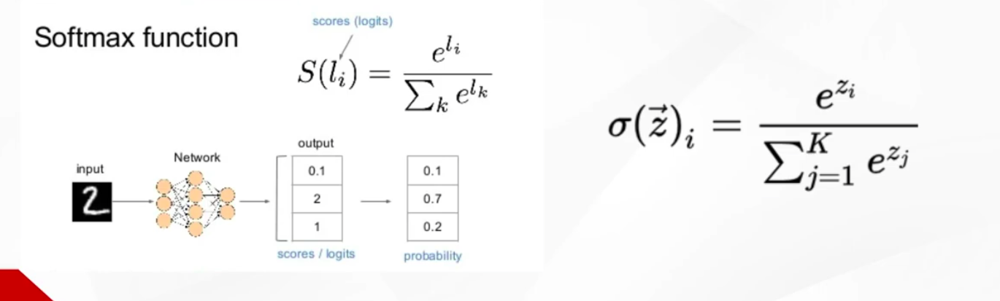

   - **Swish**:  
     One of the modern activation functions that combines both ReLU and sigmoid.  
     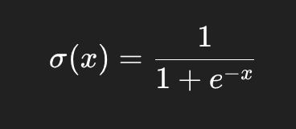  
     For large positive values, it acts as a linear function (behaves like x), and for large negative values, it approaches 0 and acts like ReLU.  
     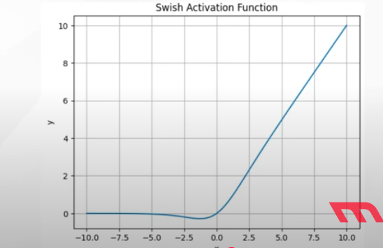  
     Smooth and differentiable around all points.  
     Computationally expensive.

4. **Bias**  
   Decides when the perceptron fires or activates.

5. **Flow**  
   Input -> multiply by weights -> add bias -> get Z  
   Z -> activation function f(z) -> final output

# Neural Network

1. **Construction**  
   While one perceptron is quite simple, at a logic gate level, multiple perceptrons build a neural network that can handle complex tasks by continuously feeding inputs to a group of perceptrons one after another.  
   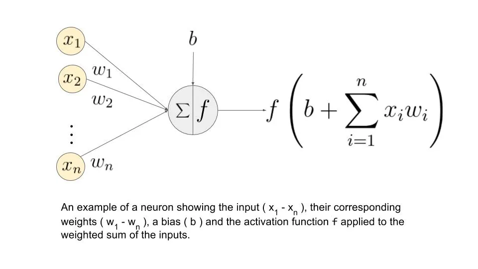  
   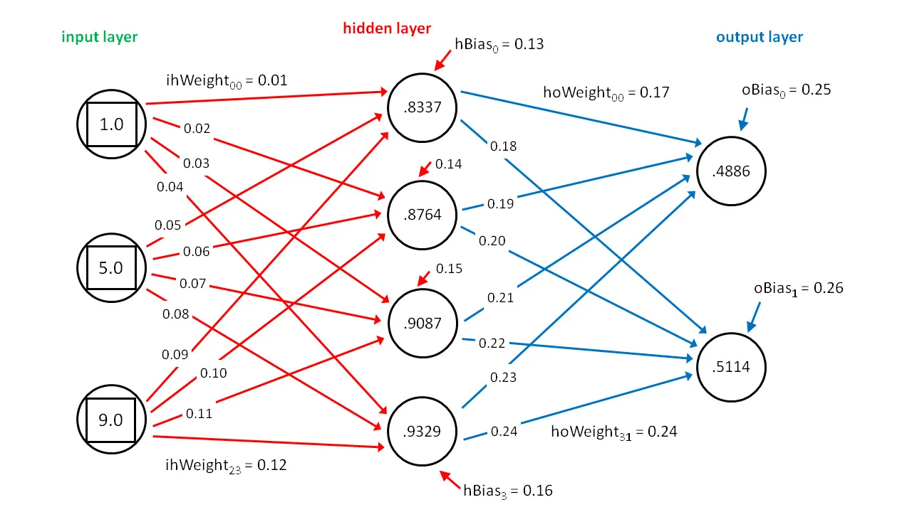

2. **Types of Neural Networks**

   - **MLP**  
     **Construction**  
     Multi-layer — multiple perceptrons and layers stacked.  
     Input layer where raw data goes.  
     Hidden layers where functions and decision-making occur.  
     Output layer -> produces final answer.  

     **Flow**  
     Data moves through layers -> model predicts something -> the loss is decided using a loss function specific to the task.  
     The error is sent by backpropagation for the network to adjust weights accordingly -> better predictions over time (like automatic tuning).  

     **Usage**  
     Works best for tabular or simple data, as it doesn't take advantage of spatial patterns like images or temporal sequences like audio and text.  

   - **KAN**  
     **Construction**  
     Inspired by Kolmogorov–Arnold representation theorem.  
     Instead of the activation function being normally:  
     z = x₁ * w₁ + x₂ * w₂, where you get a weights backpropagation,  
     KAN does it as:  
     z = f₁(x₁) + f₂(x₂), where each parameter goes through a specific function, then they're summed.  
     This allows for more specific backpropagation that may allow you to change the function each parameter is passed through, resulting in more efficient learning.  
     These functions can be seen as variable methods to handle weights, rather than it being just a variable weight.

# Back Propagation

Backpropagation is how a neural network learns by adjusting weights to reduce mistakes — it's basically a two-pass process.

1. **Flow**
   - **Forward Pass**  
     Makes a prediction due to inputs, activation functions, and passes.  
     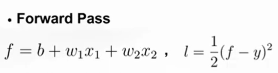

   - **Loss Calculation**  
     Calculates the loss using a loss function.

   - **Backward Pass**  
     Processes which weights caused the error and by how much.  
     To calculate that, we use the chain rule.  
     We find the slope of the loss with respect to the output (dl/dy).  
     Then, by calculating dy/dw, we can find dl/dw — the change of loss with respect to weight.

   - **Weight Updating**  
     By using gradient descent,  
     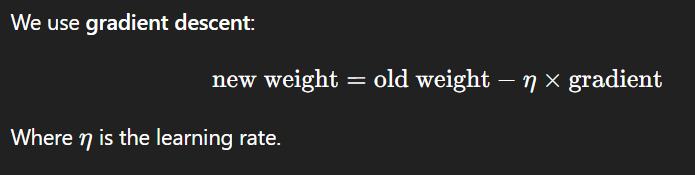  
     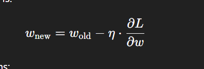  
     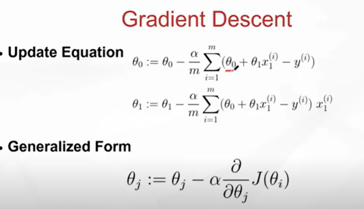  
     Where alpha is the learning rate (a small number that controls how big the step is),  
     m is the size of the batch (whole data or a mini-batch),  
     The negative sign is because we want to move opposite to the loss gradient.  
     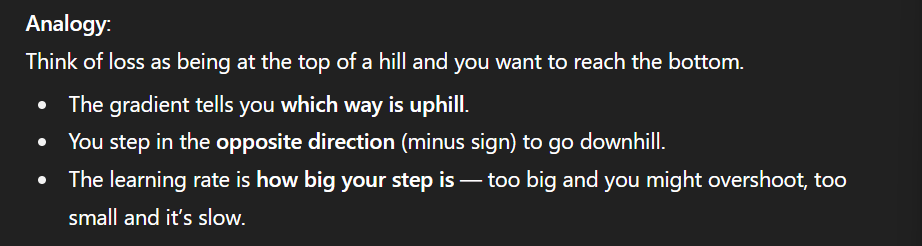

   - **Optimization**  
     Applying the previous steps multiple times with a set learning rate to increase the model accuracy with every loop. Care must be taken not to overfit.

# Training Neural Networks

1. **Weight Initialization**  
   Initializing weights can have a major impact on the training dynamics. If all weights are the same, all neurons will learn the same, resulting in poor learning.

   - **Breaking Symmetry**  
     Random initialization for each neuron ensures each neuron learns a unique feature.

   - **Prevents Vanishing Gradients**  
     When weights are too small, the output shrinks, resulting in a near-zero gradient, which is ineffective — this leads to painfully slow learning. You would need a near-infinity learning rate to compensate.

   - **Prevents Exploding Gradients**  
     When weights are too large, the output explodes, and gradients explode, resulting in learning a very large "chunk" of features all at once, causing unstable learning.

   - **Flexibility in Learning**  
     Initializing the weights as a normal distribution (most in the middle with a few outliers) allows the network to transform into other distributions during training (mathematically proven that any Gaussian distribution can be transformed into any form of distribution).

   - **Common Initialization Methods**  
     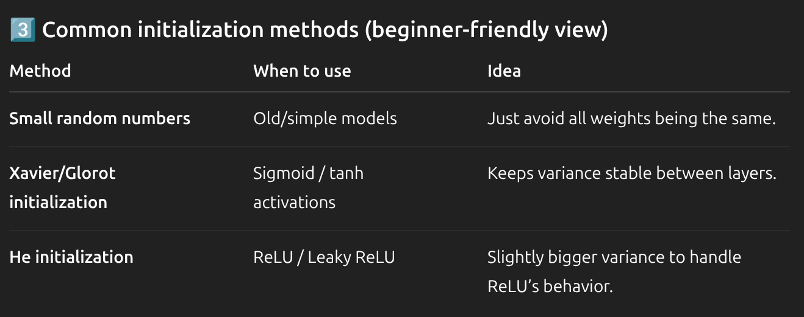  
     **Constant and Zero Initialization**  
       Used but fails for weights due to lack of symmetry and diversity.  

     **Kaiming Initialization (He)**  
       The default method in PyTorch.  
       Ideal for ReLU, ELU, and SiLU.  
       Not good for Tanh or Sigmoid, where Xavier is used instead.  

     **Orthogonal Initialization**  
       Preserves the norm of signals across layers by ensuring the matrix is orthogonal, because multiplying a vector by an orthogonal matrix doesn't change its magnitude — it only rotates or reflects.

   - **Standard Deviation**  
     A very small std results in vanishing gradients, while too large results in exploding gradients.

2. **Batch Normalization**  
   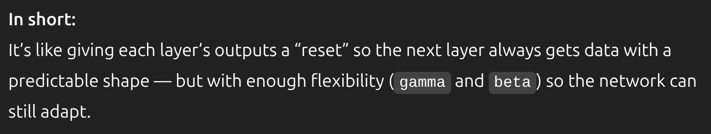  
   Normalizes the activations within each batch during training.  
   Looks at a batch of numbers (activations from a layer), normalizes them, and stretches (using gamma) or shifts (using beta).  
   Keeps the numbers in a nice range so training is stable across batches.

   **Benefits**  
   - Prevents exploding or vanishing gradients, making certain functions more stable to work with.  
   - Acts as a regularization method by adding a bit of noise.

3. **Skip Connections (Residual Connections)**  
   A powerful architectural design used in deep neural networks to address challenges in training very deep networks, such as vanishing or exploding gradients.  
   As you add more layers, training becomes harder, and vanishing or exploding can occur during backward propagation.  
   In general, the deeper the network, the worse its performance.

   Skip connections are placed after each block (multiple layers), where you pass x through the normal activation path, and in parallel, pass x directly to the output, so: y = f(x) + x.  
   This makes it easier because fixing or operating on a delta is easier than operating on the full values.  
   Also makes it harder for the signal to vanish as you're adding x every time, even if f(x) is small.

4. **Dropout**  
   During training, randomly turn off some neurons in a layer, forcing the network to not be neuron-dependent.  
   Every neuron is trained so that they're effective as a whole.  
   Before testing, disable dropout and use all neurons, but scale their outputs.

   **Prevents Overfitting**  
   Encourages redundancy, so multiple neurons are able to detect the same feature, making the network more robust and accurate.  
   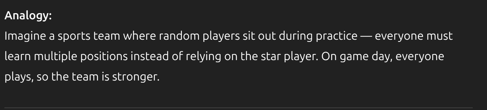

   **Method**  
   Taking the input to some layer and adding it directly to the layer's output, passing the original signal without multiplication against other gradient steps and the non-linear steps — prevents degradation of the signal.  
   Output = f(x) + x.

   Without skip connections:  
   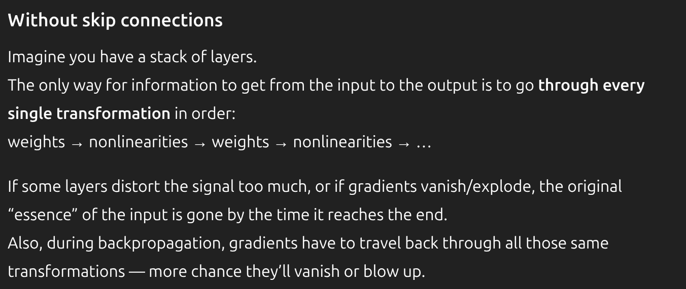  
   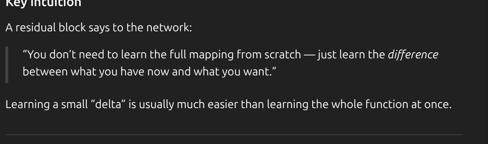

# Appendix

1. **Broadcasting**  
   Broadcasting is a way for Python libraries to automatically stretch arrays so they match in shape to be suitable for the current operation.  
   Used in the equation in image.png  
   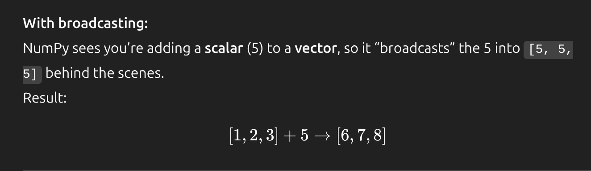

2. **Kolmogorov–Arnold Representation Theorem**  
   The theorem states that every multivariate continuous function (a function that takes multiple continuous variables as inputs) can be represented as a superposition (a method of calculating when you calculate a variable effect and assume all other variables are constants, then you add those effects to get the actual effect of all results).  
   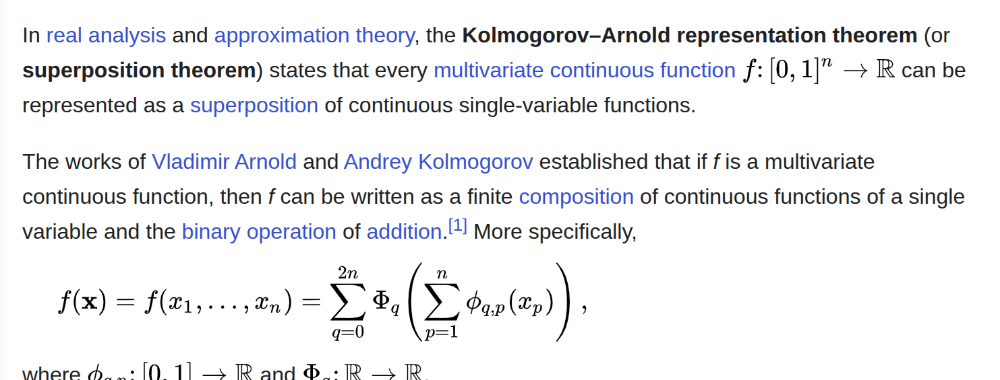

3. **Universal Approximation Theorem**  
   States that a single hidden layer with enough neurons and a non-linear activation function can approximate any continuous function. More neurons mean higher accuracy.

4. **Dead Neuron Problem**  
   A dead neuron is a neuron that gives the same output regardless of the data, which usually occurs in very large values where the slope becomes zero (the output flattens, making the slope zero). If the neuron gives values in a digital style, at very large or small values, it'll likely give the same output.  
   The way ReLU fixes this problem is that for positive values, even if the input changes a little bit, the output will change by this little bit, resulting in an analog matter that delays the death of this neuron.

5. **Jacobian**  
   A Jacobian matrix is simply a table of all partial derivatives of a vector-valued function.  
   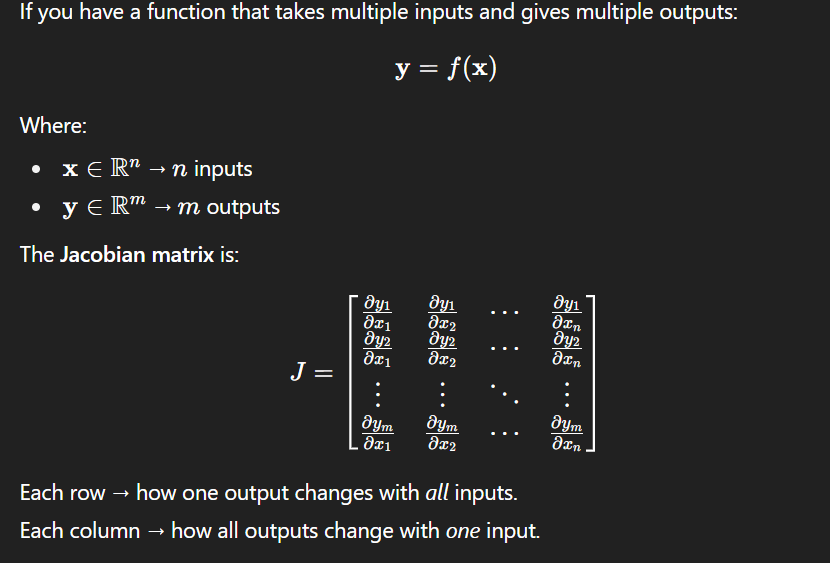  
   Used in complex matrices to store how each output varies with all inputs fed to it — size = n of outputs x n of weights.  
   Multiplying this matrix by a matrix that holds dl/dy (which has the size of n of outputs x 1) will give you a n outputs x 1 matrix representing dl/dw.  

   For example, row 1 will be dy₁ / dw₁, dy₁ / dw₂, dy₁ / dw₃ in the Jacobian matrix.  
   The loss matrix column 1 will be dl/dy₁.  
   By multiplying both, you get row 1, column 1, dl/dw₁ + dl/dw₂ + dl/dw₃, representing the loss rate with respect to weights affecting the first output -> chain rule.  
   Multiple chain rules can be applied due to many layers having multiple Jacobian matrices.

# References

https://www.youtube.com/watch?v=YUKjUFuc5cU&t=336s  
https://youtu.be/4pc8sn767hc?si=B4Ayyr77Dw667EJu

https://chatgpt.com/c/689f3e19-f830-8322-a932-82d9232fca2d  
https://medium.com/coinmonks/the-mathematics-of-neural-network-60a112dd3e05  
https://en.wikipedia.org/wiki/Kolmogorov%E2%80%93Arnold_representation_theorem
