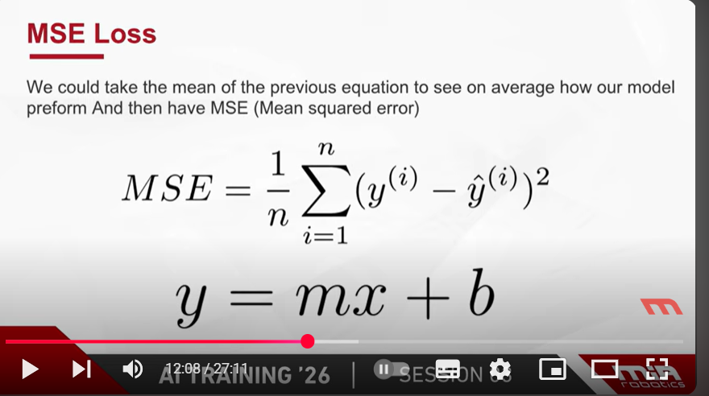
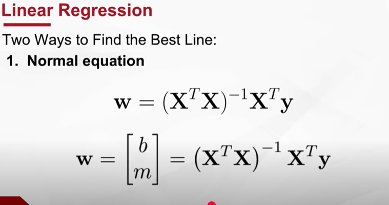
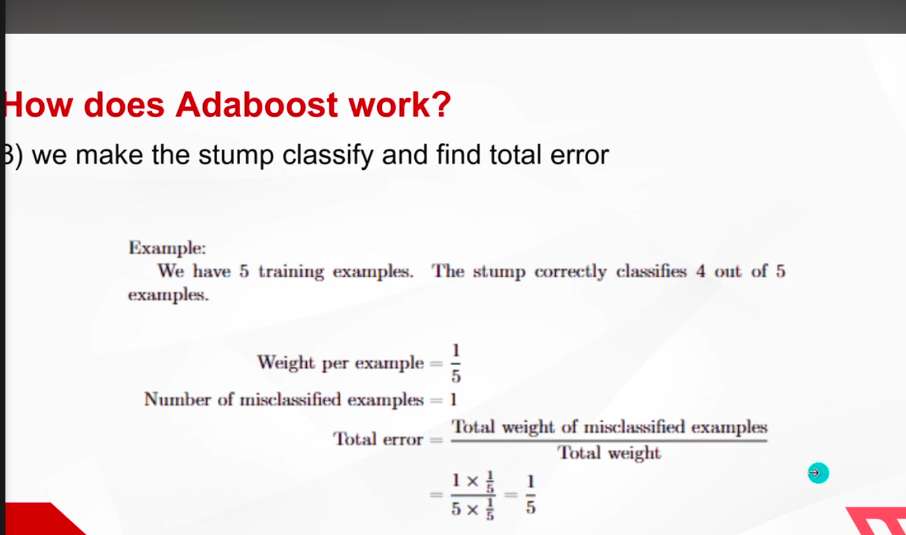
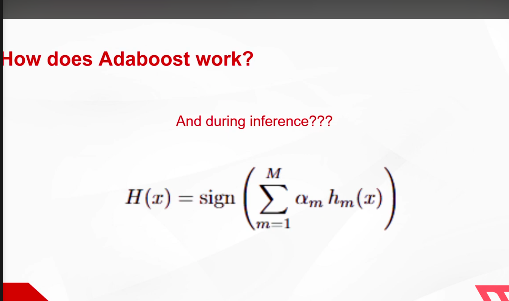

# Types of machine learning
-supervised -> the machine has a labeled data that it stars to connect between its parameters making it labeled this way

-unsupervised -> the machine is left on its own without lables to figure it itself

reinforcement learning -> learns by a reward/penal relation with the model interactions with environment 

classfiction -> splitting objects on genres/types based on their attirbute 

regression -> finding a relation between multiple values -> like linear regression 

__Supervised learning__
linear regression -> learning algorithm to predict the future based on existing data 
finds the best line passing through the clusters -reaching points themselves or close to them-

MSE -> mean squared error  -> the average of all errors squared 

two ways to find best line 
normal -> 

the highest entropy is 50% , the highest level of uncertainty of your data 

each split in the tree must give you more information , giving you higher entropy diffrence 
highest information gain is prefered to be in the start 
stop when entropy hits 0 -> you're sure its that type then 

trees are really prone to overfitting , leading to poor generalization 

# Ensemble techniques
combines the predictions of multiple models to improve overall accuracy and robustness 
-> bagging 
reduces the variance "overfitting" be averaging the predection of multiple models 
each dataset has different entroby resulting in a different root node

# Boosting
aims to reduce bias sequantially training models , each trying to correct the errors of its prodecessor
each model learns from the mistakes of a previous model

Adaboost 
1) initialize weights : assigning equals weights to all example 1/n weight 
create base learners (weak learners) known as stumps which is essentially a tree with depth 1 , a single dicision before making a prediction 
each stump classfies the error according to correct label 
-> then it increases the weight that's the mistake was on to make the model focus on it more next time
decreasing the weight of the stumps it got correct results also in the same thing -> update weights

after that weights are normallized 
then reply again 

for all the system

models with higher correct predection rate have higher weight , usually higher ones are the ones learning from previous mistakes

# Gradient boost
instead of continous reweighting data points , it learns from mistakes of previous models by minimizing a loss function using gradient descent 
1) initalize a model for regression , mean of all targel values for classification