# Vector Equation of a Line  
- Subtract two points → get direction  
- Or subtract a vector from a point — both end at line tip  
- Use a position vector to any point on line + vector parallel to line  

**r = r₀ + t·m**  
→ `r₀`: offset (point on the line)  
→ `m`: direction vector (parallel to line)

### Parametric Form  
```
x = A + t·Vx  
y = B + t·Vy  
z = C + t·Vz  
```
Where (A, B, C) = point on line, (Vx, Vy, Vz) = parallel vector  

---

# Equation of a Plane  
**Ax + By + Cz = D** → (A, B, C) is ⟂ to the plane (normal vector)  

Or using a point (X₀, Y₀, Z₀) on the plane:  
**(X₀−X)A + (Y₀−Y)B + (Z₀−Z)C = 0**  

ABC = normal vector → get it using cross product of 2 vectors in the plane  

---

# Intersections of Lines in 3-Space  
If one vector isn't a scalar multiple of the other → possible intersection  
Try solving both equations to find a point that satisfies both  

---

# Intersection of Planes  
Their normal vectors shouldn't be parallel  
Cross product of their normals → gives direction of the line they intersect in  

---

# Elementary Row Operations  
Keeps same solution set:  
- Interchanging: swap two rows  
- Scaling: multiply row by a constant  
- Replacement: replace a row with sum/diff with another row  
  (like adding equations → makes a dummy equation)

Used for:  
- Gaussian elimination (solving systems)  
- Computing model parameters  
- Realizing level/redundancy in data by reducing to row echelon form  

---

# Reduced Row Echelon Form (RREF)  
Target form after using row ops — easy to spot no/∞/unique solution  

1. Each non-zero row starts with a leading 1  
2. Leading 1s move right as you go down  
3. Zeros above and below every leading 1  
4. All-zero rows go to the bottom  

→ Clean structure lets you read solutions, see rank, pivots  
- If system is consistent (has ≥ 1 solution), variables are either free or basic  

Each column without leading 1 → free variable  
Basic variables:  
- Controlled by system  
- All basics are dependent  

Free variable:  
- Not constrained  
- Can take any value → won’t affect others  

---

# Gaussian Elimination  
Turn matrix into row echelon form using elementary row ops  
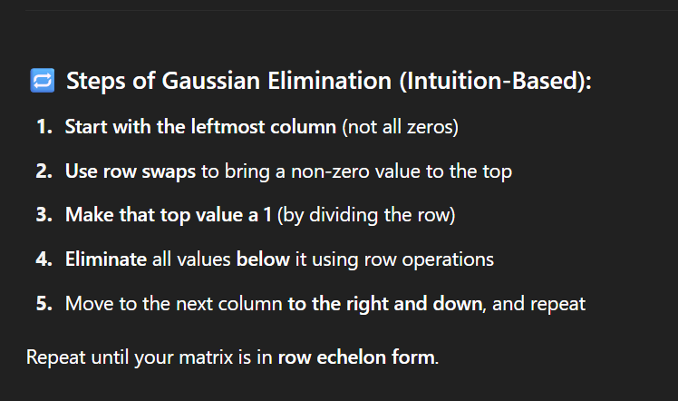  

1. Sensitive to bad data → near-zero/similar rows can break it  
2. Fewer pivot rows than columns → not full rank → no or ∞ solutions  
3. Free variables = no unique solution → could be zero or infinite  

---

# Determinant  
If det = 0 → vectors are squished → no unique solution  
Matrix isn’t invertible  

Inverse matrices = expensive + unstable → avoid unless debugging weird behavior  

---

# Inverse by Row Reduction Summary  
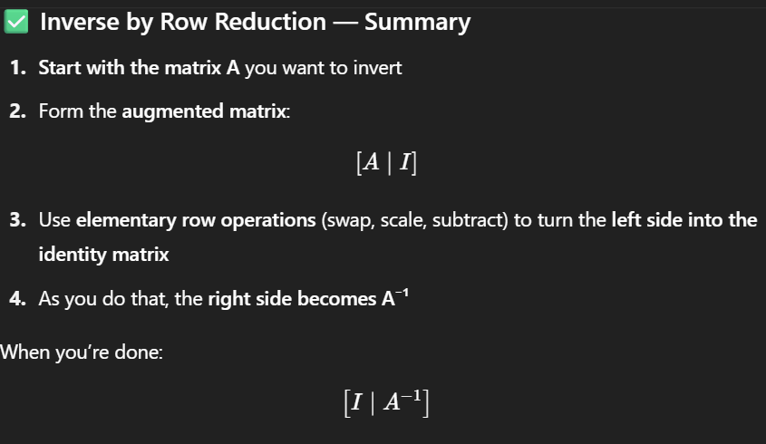  
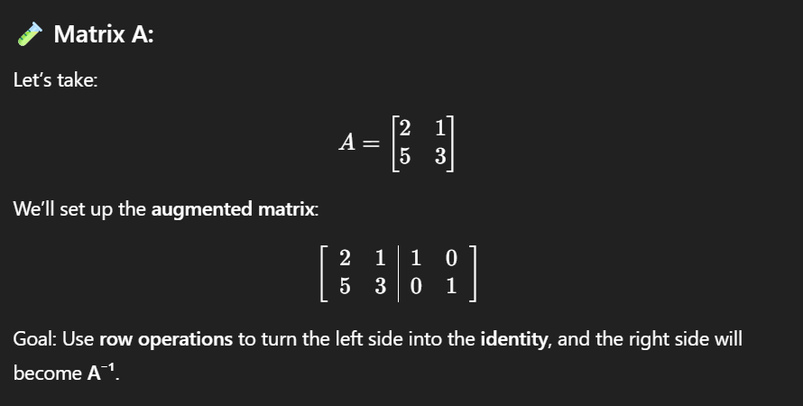  
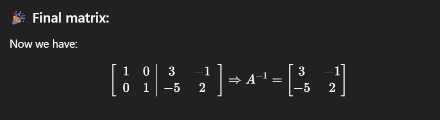  

---

# Cramer’s Rule  
AX = B  
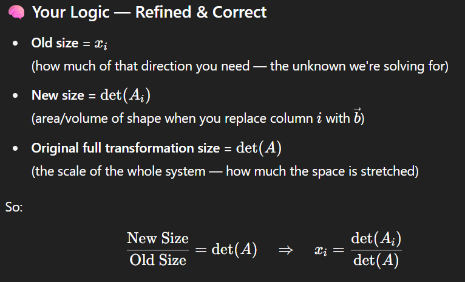  

**Box Logic Intuition**:  

1. Imagine a box with:  
   - one side = x in î  
   - other side = 1 in ĵ  
   → area = x × 1 = x  

2. Matrix A transforms space → scales by det(A)  
   → new area = x × det(A)  

3. To isolate x:  
   - Replace î column in A with B  
   → new area = det(A₁)  

So,  
**x = det(A₁) / det(A)**  
Repeat for y: replace ĵ → **y = det(A₂) / det(A)**  

General:  
**xᵢ = det(Aᵢ) / det(A)**  

---

# Eigenvectors & Eigenvalues  
Eigenvectors → same direction after matrix transform  
Eigenvalues → how much that direction is stretched/flipped/squished  

- Eigenvalue = 0 → in kernel (null space)  
- Show system behavior over time or space  
  (iterative systems, physics, ML...)  
- Used in:  
  - dynamical systems → stability  
  - PageRank → long-term importance  
  - Neural nets → input directions  
  - Vibration modes  
  - Circuit/control systems → stability  

If you use them as new basis → matrix just stretches/shrinks → simpler  
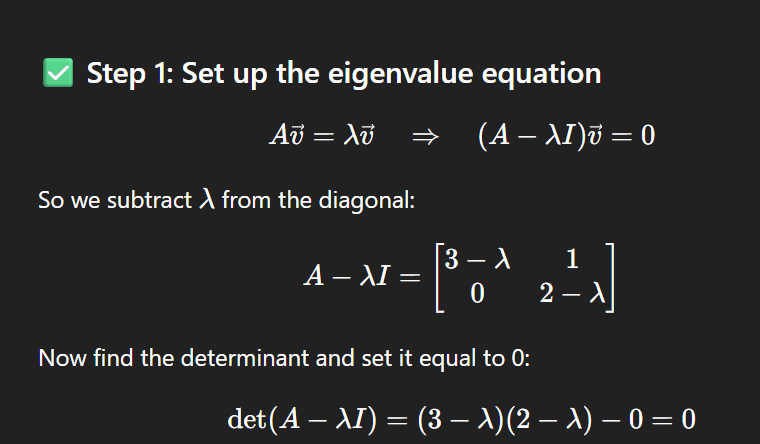  

---

# Probability  

## Distribution  
How likely outcomes are for a random variable  

- **Discrete** → countable outcomes (dice, coin) → PMF  
- **Continuous** → ranges (height, weight) → PDF  

→ Total probability = 1  
→ Never negative  
→ Distributions show likelihood, not actual values  

In practice: few readings → approximate using deviation → saves time  

---

# The Normal Distribution  
Bell-shaped, values cluster around mean  
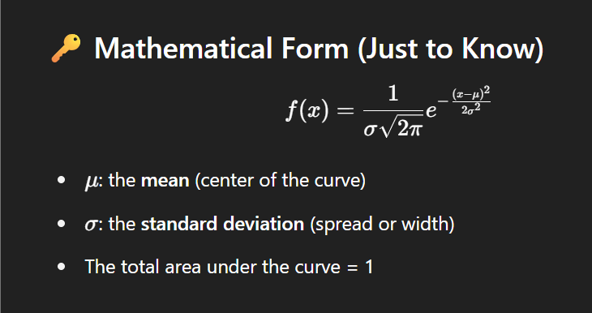  

- Large deviation → wide curve  
- Small deviation → tight curve  

**68–95–99.7 Rule**:  
- 68% within 1σ  
- 95% within 2σ  
- 99.7% within 3σ  

Many models assume normality → regression errors, Gaussian features, PCA  

Values outside 3σ → anomalies  

**Central Limit Theorem**:  
Take many sample means → they form a normal distribution  
Even if original data is skewed or messy  
→ Noisy values cancel each other out → pull toward center  

---

# Experimental Probability  
Estimated by actual experiments or observations  
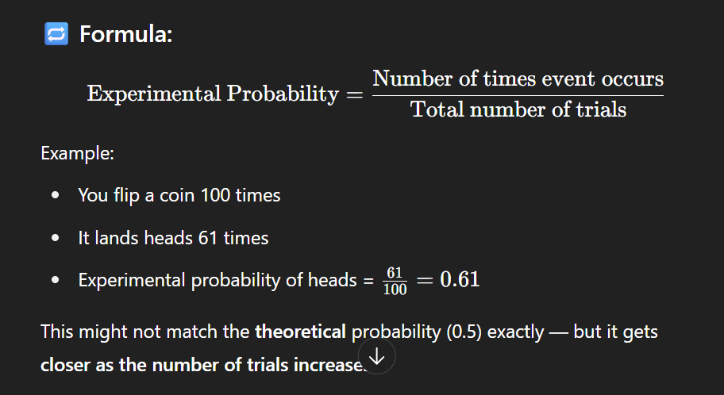  

→ Gets more accurate as number of trials increases  
→ Use when theoretical P is unknown or to check how well real-world matches theory  

---

# Probability with Sets  
View outcomes as groups:  

- **Union**: A ∪ B (subtract overlap)  
- **Intersection**: A ∩ B  
- **Complement**: P(A*) = 1 − P(A)  

---

# Conditional Probability  
Probability of A given B:  
**P(A|B) = P(A ∩ B) / P(B)**  
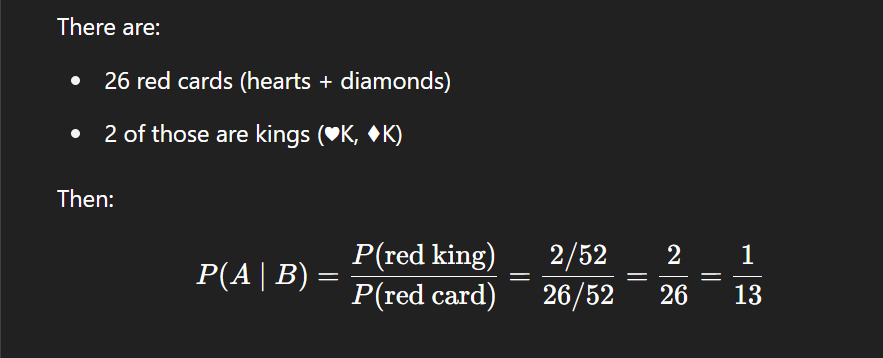  

→ We’re zoomed in on B → what’s the chance A also happened?  
→ Great for identifying relationships  

**Causal Inference**:  
→ Correlation ≠ causation  
→ Difference = what if we fix B?

---

# Multiplication Law  
- **Independent Events**:  
  **P(A ∩ B) = P(A) × P(B)**  
  → Doesn’t depend on each other  

- **Dependent Events**:  
  **P(A ∩ B) = P(A) × P(B|A)**  
  → B depends on A happening  

Draw **with replacement** → independent  
Draw **without replacement** → dependent  
→ Changing the total affects next outcome  

---

# Permutations  
Ordering matters  
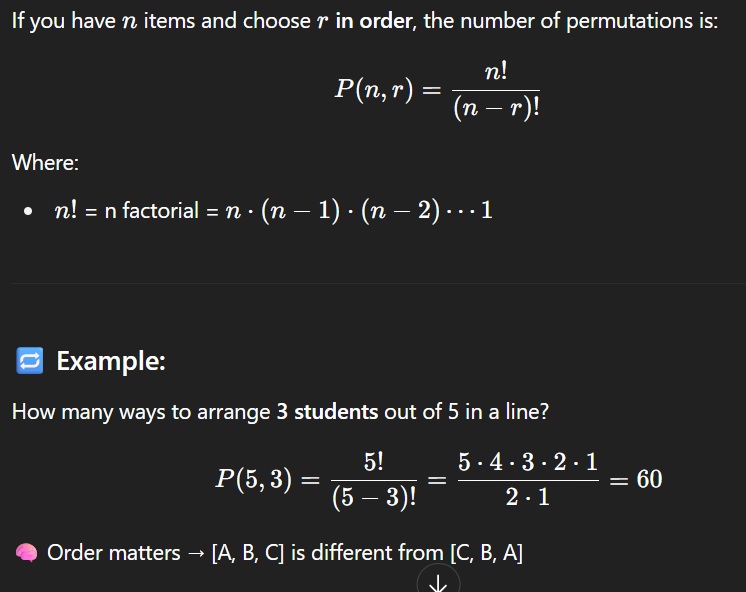  

- Ex: pick 3 books → then arrange  
- Total sequences = permutations  

**Repeats?**  
→ Divide by factorial of repeated elements  
(e.g. 2 same letters → divide by 2!)  

---

# Combinations  
Order doesn’t matter  
  

→ Just choosing, not arranging  
→ Divide permutations by r! (ways to arrange r items)

---

# Continuous Probability Distributions  
Infinite values → probability = area under curve  

- Mean = center (highest point)  
- Standard normal: mean = 0, dev = 1  
→ Perfectly symmetric  

**Z-Table**:  
Tells area (probability) from Z value to left side  

---

# Binomial Distribution  
Success/failure in fixed number of trials  
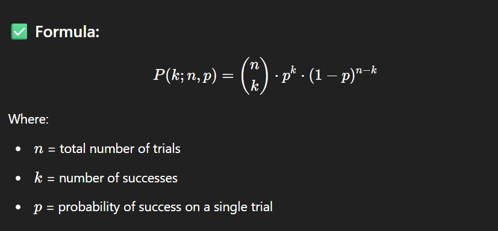  

- 2 outcomes → 0 or 1  
- `p` = success, `1−p` = failure  
- Need all sequences → use permutations  

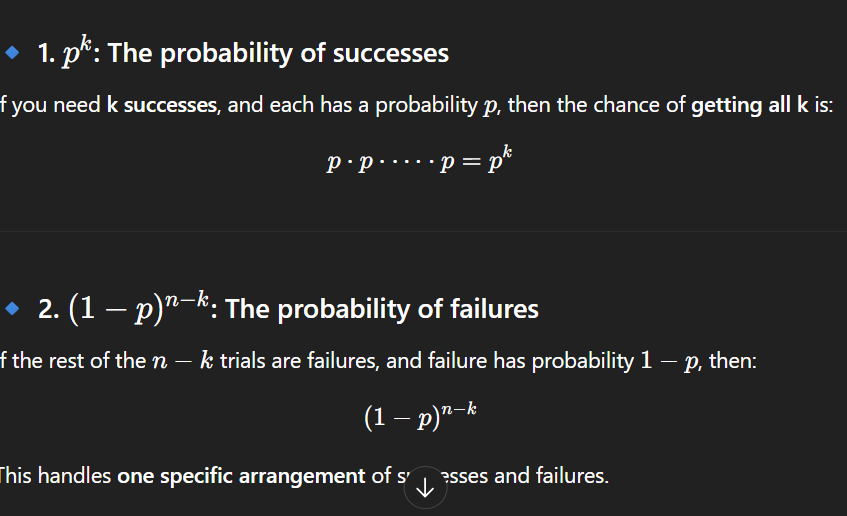  
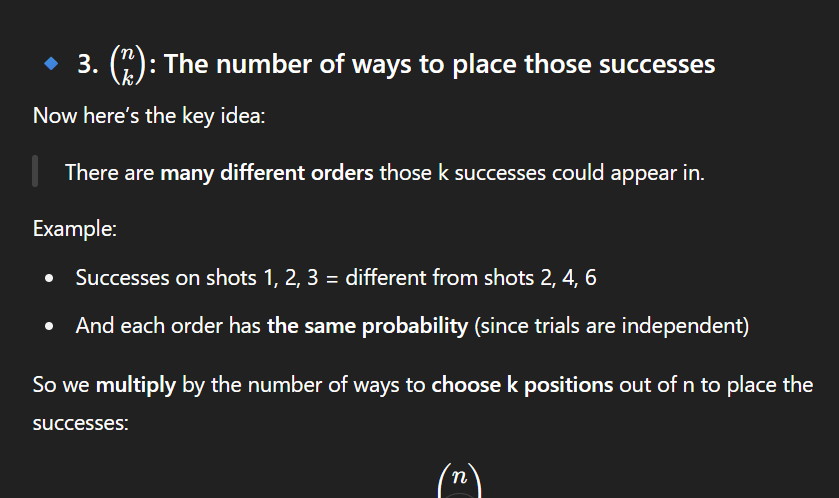

---

# Geometric Distribution  
Trials until 1st success  
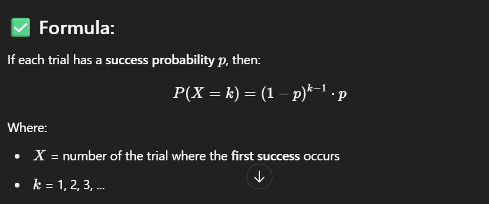  

- All fails except last → success  
- P = (1−p)ⁿ × p  
- Doesn’t care about order — just how many until success  

→ Requires 2 outcomes + independent trials + fixed p  

---

# Covariance  
How 2 variables move together  
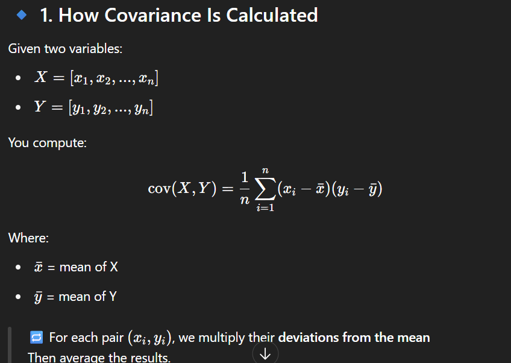  

- Both up/down → positive  
- One up, other down → negative  
- Independent → near 0  

---

# Correlation  
Scaled covariance → measures direction + strength  
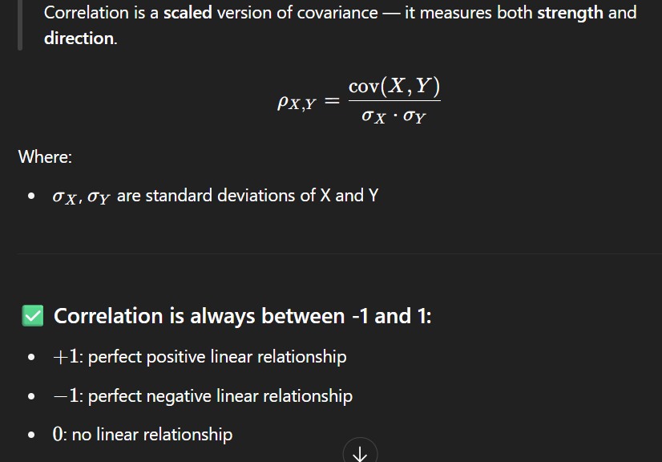

---

# Bayes’ Theorem  
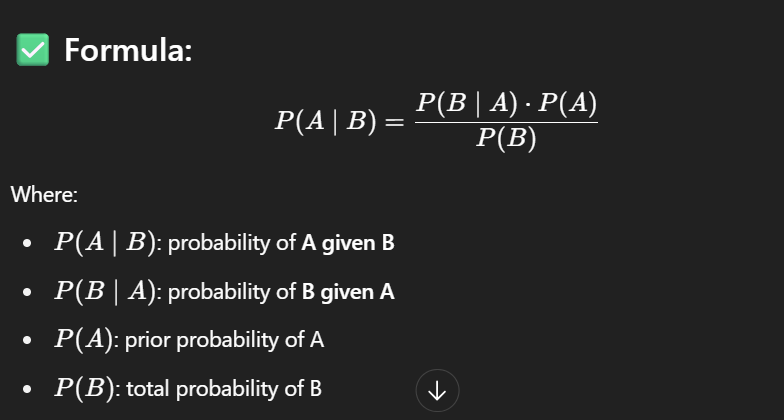  
→ Probability changes based on known info  
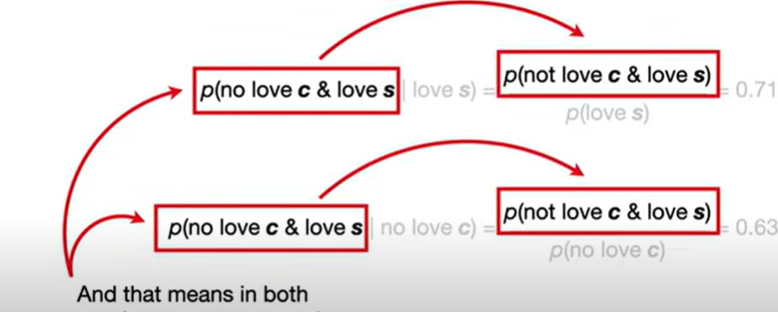

---

# Histograms  
Bar plot showing frequency in value ranges (bins)  
→ Useful when values overlap or are dense  

- Can support your distribution guess  
- Bins shouldn't be too narrow/wide  

Helps decide:  
- Whether to normalize or standardize  

---

# Quantiles  
Split data into equal-sized chunks  
→ Used for:  
- Labeling (high/mid/low)  
- Outlier detection  
- Robust scaling (median, IQR)  

**Median = quantile** (splits in half)  

---

# Percentiles  
Special case of quantiles → 100 chunks  
→ Similar effect in big datasets  
→ In small sets: check carefully
