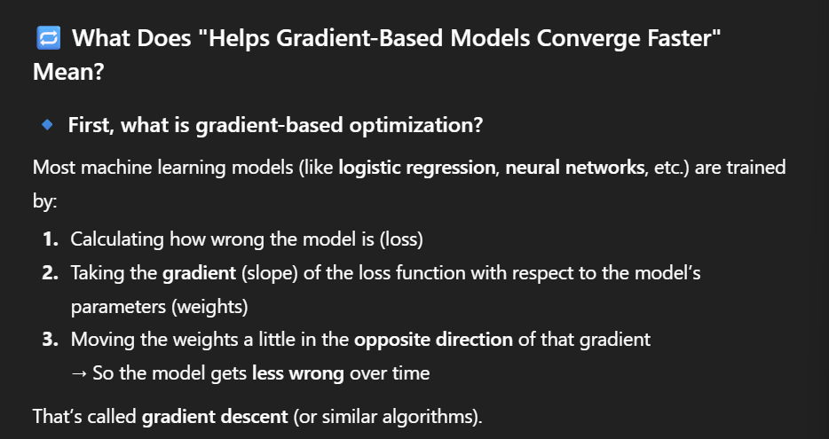
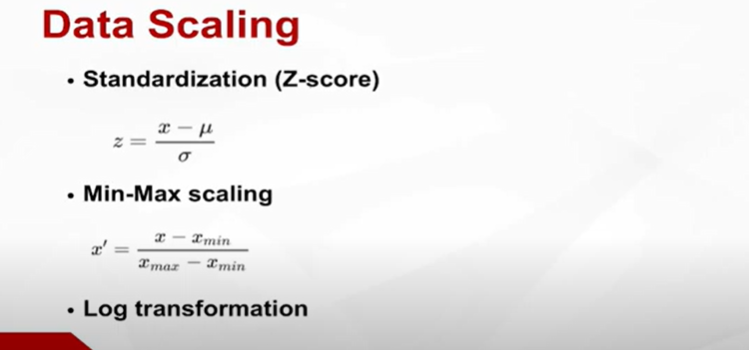
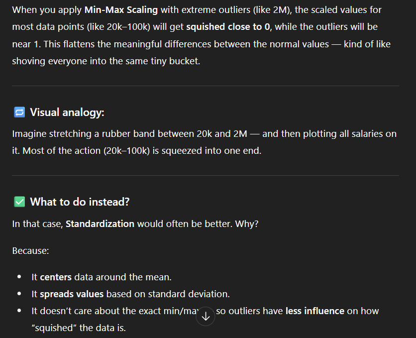
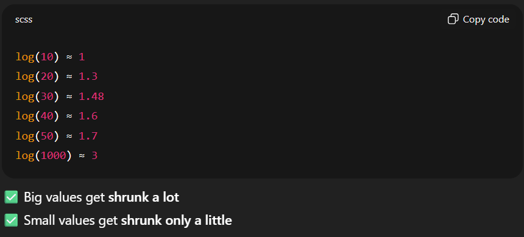

impute is putting mean values for missing values in parts of the dataset , if many values are missing , the part is removed itself  "sample"

Gradient-based models are models that learn by being less wrong each time 

# DATA SCALING
to limit contribution of feature much more than other features that it makes them ineffective 

standardization is the process of transforming data so it has mean = 0 ,deviation = 1
- puts features on similar  scale
- not used with tree based models as they're not affected by scaling

- makes gradient-based models faster as they've the same "loss slope" equivalent across all parameters
- widely different scales would result in vanishing or exploding , or training getting stuck

__min max scaling__
rescales data on a fixed range [need to know the bounds of your data]
your data isn't normal -standard distribution
you want to keep data skew

isn't preferred when the maximum is very large while most values are below because they'll all approach zero (squeeze)

standardization is less sensitive to outliers as min max values aren't set perfectly

__Log transformation__
used with skewness and compressing large values , often applied as log(x+1) to handle zeros

right skewed data is data with most values small and very large outlier
_useful when data is skewed , makes patterns more linear for regression model

# Data splitting
Training set -> 60-70% to train the model on 
Validation set -> tunes hyperparameter
test set ->final check on unseen data

# Data leakage 
