# Cameras 
Lens > focuses light
Aperture > controls how much light enters
Sensor > turns light into electrical signals
image > a 2D grid of pixels each storing brightness and color 

## Camera Theory
### Operation
a camera takes light from 3D world > bends it through a lens then projects onto a flat 2D sensor 
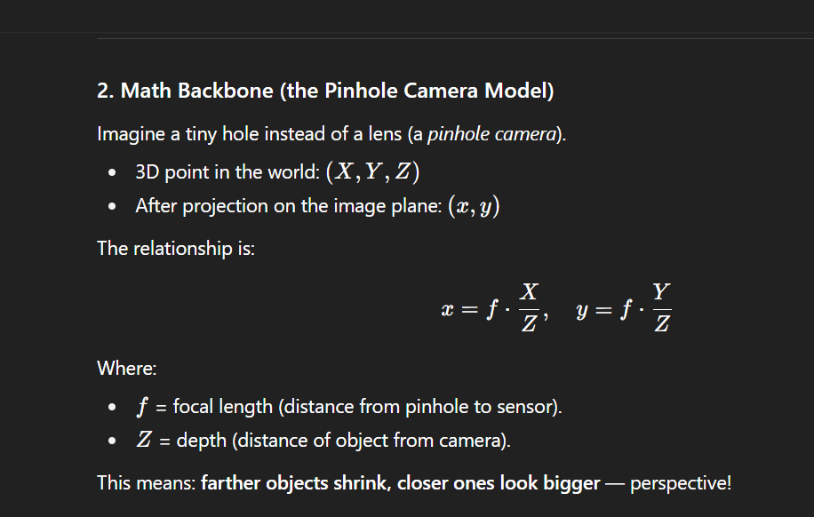

### Parameters 
Intrinsic parameters > camera's internal properties such as focal length , pixel size and shape , principal point , distortion 
1. Focal length 
    Falls between sensor and the nodal point (the point that captures the actual image)
    How strongly the lens focuses light

2. Principal point 
    The center of the image , right in the middle of the image sensor in ideal cameras

3. Skew coefficient 
    tells if the sensor's X and Y are perfectly perpendicular  ~0

4. Lens distortion 
    Radial distortion > straight lines bend 
    Tangential distortion: lens isn’t perfectly aligned with sensor → things stretch diagonally.

    > Robots must correct this for accurate measurements.

This parameters are often summarized in the intrinsic camera matrix
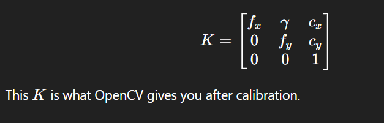

Extrinsic parameters > camera's position and orientation in the world 
1. Rotation 
    How the camera is oriented (pitch ,yaw)

2. Translation 
    where the camera is located in world coordinates

together those parameters form the camera matrix that converts 3D space in world to 2D pixels Z
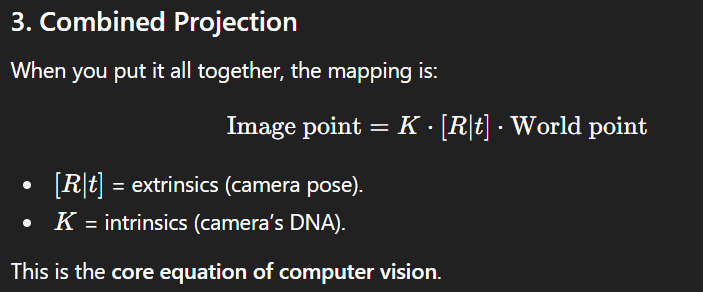

## Camera Calibration 
The goal finding the mathematical mapping between 3D points in the world and their 2D projections in the image , 
this means solving for intrinsic (K) and extrinsic(R,t)
the robot uses this calibration to realize the 3D world distances and angels from the 2d grid received 

### Coordinate System 
- World coordinates          -> real environment (X,Y,Z)
- Camera coordinates       -> 3D points relative to the camera's eye (Xc,Yc,Zc)
- Image plane coordinate -> where x,y of the 3D world are projected on (x.y) of the image
- Pixel coordinates            -> actual pixel position on the sensor

"World" -> Extrinsic matrix > "Camera" -> Projection > image plane -> intrinsic matrix > Pixel 
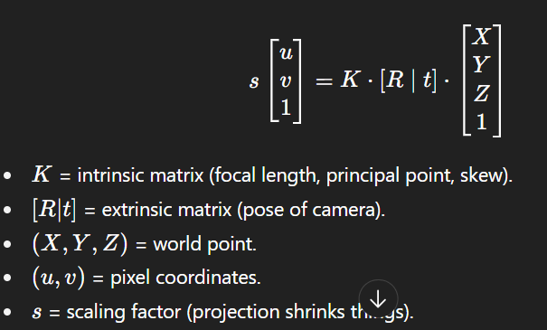

using the extrinsic and intrinsic matrices will only get you the x,y coordinates in real world , you still need the depth

### Depth Calculation methods
1. Stereo Vision 
    Using two cameras side by side (like eyes) , ths shift in the image between the left and right eye calculates the distance
    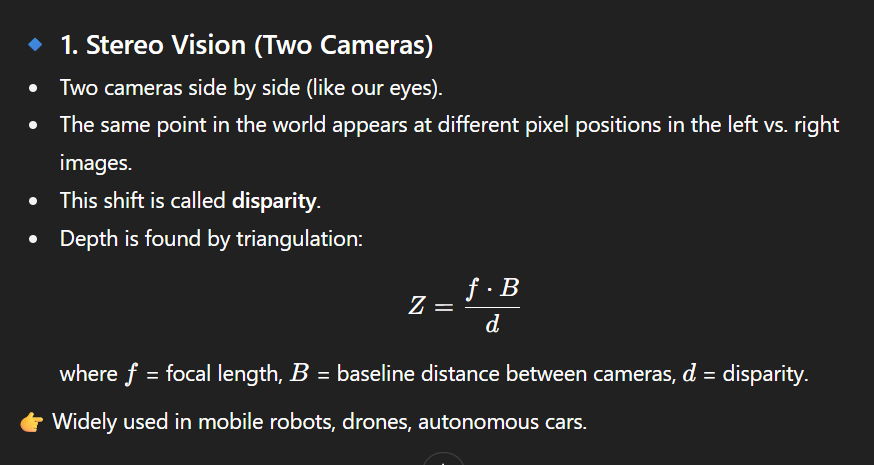
widely used in mobile robots

2. Depth Cameras
active sensors that actively measure distance 
   ToF -> emits infrared light and measures return time , time * speed = distance
   Structured light -> projects a known pattern and see how it wraps(how its distorted)
   Lidar -> send laser pulses and measures reflection time
Very common in automated cares

3. Monocular depth 
Using single camera and assumptions
    Geometric cues -> using known object sizes (a stop sign is 70cm for ex)
    Motion parallax -> as the robot moves , closer objects shift faster across the camera
Used in low-cost robots and drones

# Image Processing
## Digital image -Bitmap image
a digital image is a representation of a 2D image as a finite set of digital values , known as pixels 
each pixel has a specific value representing its color and brightness
all the pixels combined make the image as we see it 
- in a grayscale image each pixel has one value that represents the intensity of light  [one matrix]
- while in RGB model each pixel will contain three values each representing the intensity of each color [three matrices]
- 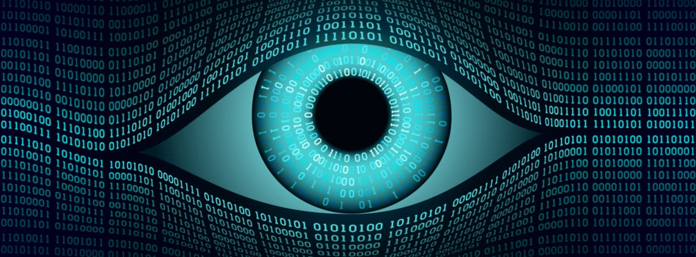

## Creation 
1. picture to digital conversion 
this operation is done after the camera sensor returns the image as an analog signal 
    by sampling we break the continuos coordinates (x,y) into a grid of pixles then by quantizing we map intensity values (from 0 to 255) to each pixels matrix
    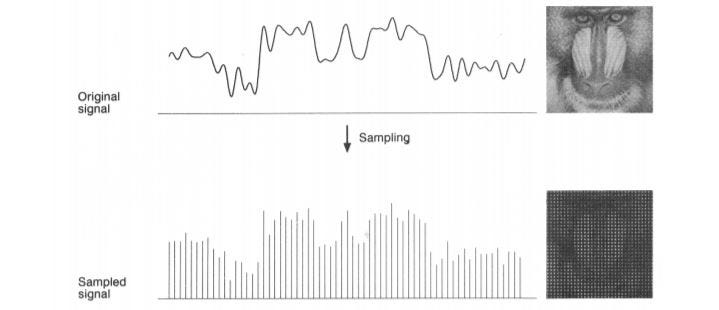

## Types of digital images
1. Binary images 
    1-bit (0 for black and 1 for white) used for masks
2. Grayscale image
    8-bit(0-255 gray levels) , most common for processing 
3. Color image 
    24-bit (RGB) with each color taking 8 bits , combined gives full color
4. Multispectral/hyperspectral 
    multiple channels , use in satellites and robotics  
5. Depth maps
    each pixel encodes distance rather than color , usually by assigning a darker value for closer objects and lighter for farther
6. RGB-D 
    combining the camera's RGB image with the depth map , you get an image with both object x,y due to camera and z due to an environment dependent depth sensor
    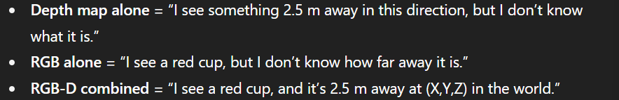

## Pixel Properties
1. Intensity 
    refers to how light or dark a pixel is 
2. Color
    each channel represents a color , ex RGB has 3 channels

## image Properties 
1. Resolution 
    Number of rows x columns of pixels
2. Bit-depth 
    Number of bits per pixel , more bits means higher quality and more detail
    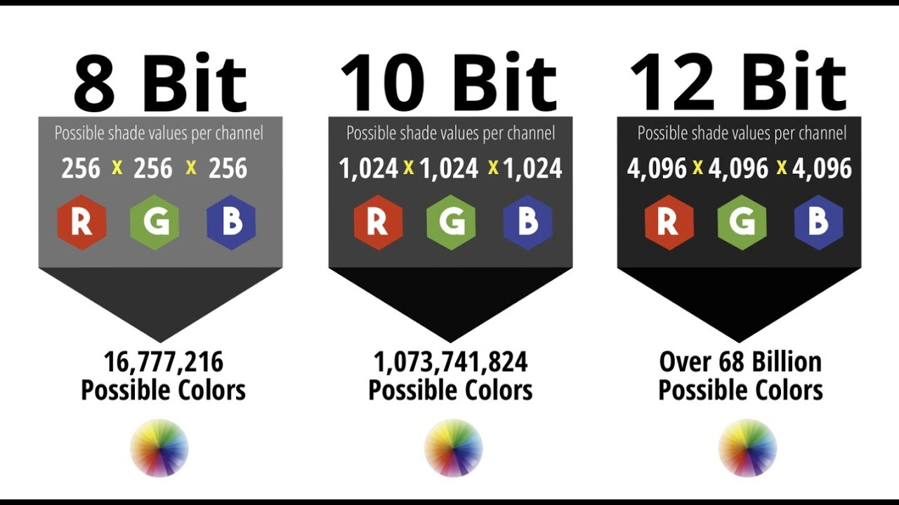
3. Memory size
    Width x height x bit-depth x n of channels
4. Brightness
    overall level of average intensity of the whole image not just comparing individual pixels
5. Contrast
    measures the difference between the intensity of low-intense pixels and higher ones , the higher the contrast the more visible the difference and detail between pixels in an image 
    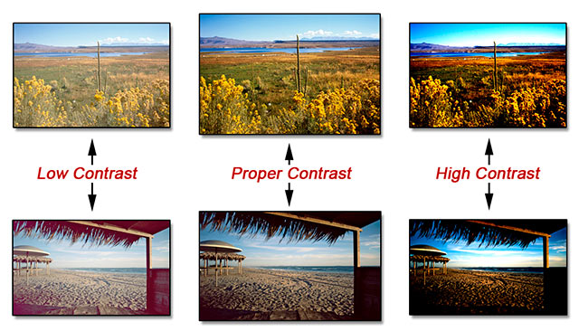

# Image Noise 
image noise is unwanted pixels that don't represent the actual scene weather they represent wrong brightness or wrong color

while noise is unpreventable , methods can be taken to reach a high SNR (signal to noise ratio)

## Noise Sources
a digital camera consists of electronics , `electronics are prune to noise` due to different things like temperature , humidity , lighting , Dust
this environmental effects results in an unwanted fluctuations 

## Types of Noise
1. Random noise 
Gaussian or `Shot Noise` due to random fluctuations in light reaching the sensor , or thermal activity 
Fixed by 
    Averaging multiple frames 
    Gaussian/median filters
    Better sensor cooling

2.  Fixed noise
Known as hot pixels that always outputs a high brightness regardless of the actual brightness received , occurs when the pixel is exposed to heat for a long time 
Fixed by
    Pixel remapping (camera firmware replaces hot pixels with avg of neighbors)
    `Median filtering` 
    Cooling the sensor 

3. Salt-and-Pepper Noise
Random black and white pixels due to faulty pixels or transmission errors , occurs in analog systems more as they're more prune to transmission errors
Fixed by
    Median filtering

# Filters

# Appendix 
- Noise in electronics 
   Analog vs Digital : digital systems are less affected by transmission errors and attenuation because they can be regenerated along the way after safe distances
   -distances where the original 0s and 1s are still close to their original values so they're easily recognised and regenerated back-

   Thermal : due to thermal energy (temperature) electrons move faster , collide with each other resulting in missing some parts of the signal

   Shot Noise : While the average number of electrons passing through a "noticeable" time is constant (constant current) , looking instantaneously different number of electrons will pass through the barriers (those barriers can be photodiode barriers or the barrier between valance and conduction band in semiconductors).
   "noise reach the barrier in a random matter , random n of electrons each time" resulting in a current that differs continuously if studied microscopically.
   -follows a Poisson statistics
    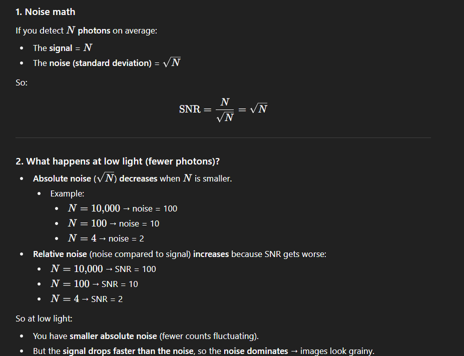

- Median Filtering 
    Instead of reducing noise by replacing noisy pixels by the average of its neighbors , you replace it with the median value > keeps sharp edges while removing extreme noise.
   

# Reference
`Camera Calibration`
https://www.geeksforgeeks.org/machine-learning/calibratecamera-opencv-in-python/

`Digital images`
https://www.geeksforgeeks.org/computer-vision/what-do-you-mean-by-digital-image/

`image noise`
https://www.cambridgeincolour.com/tutorials/image-noise.htm
https://www.cambridgeincolour.com/tutorials/image-noise-2.htm
https://www.learningwithexperts.com/blogs/articles/image-noise-why-it-occurs-and-how-to-avoid-it?srsltid=AfmBOopS5-bDASrwqeDBU26lSjDrTTd1SVf7wjr-Ts_3GWaYF4Ah4YLV

`Electrical Noise`
https://www.allaboutcircuits.com/technical-articles/electrical-noise-what-causes-noise-in-electrical-circuits/