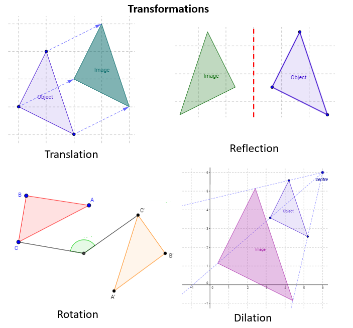
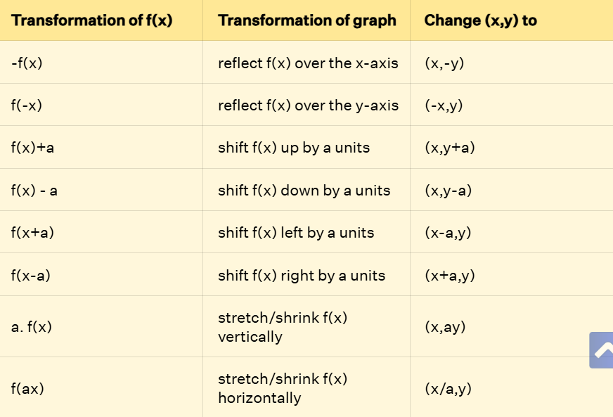
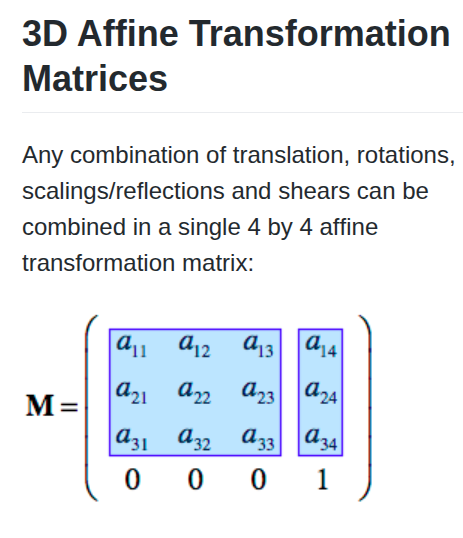
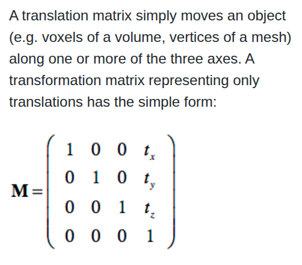
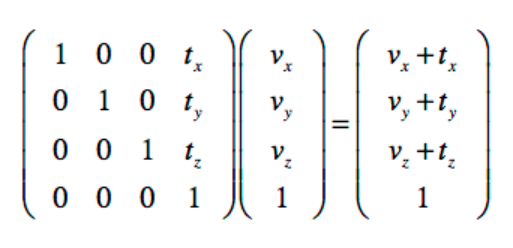
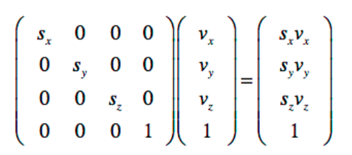
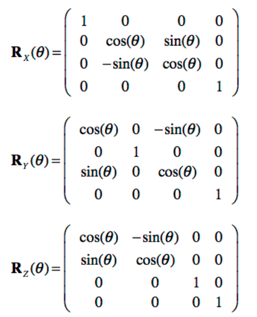
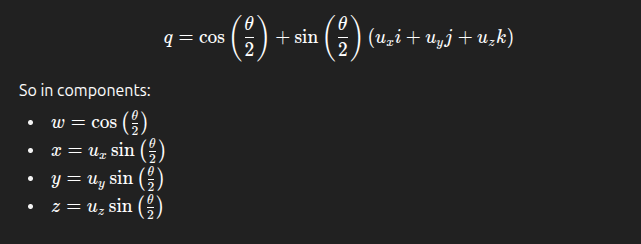
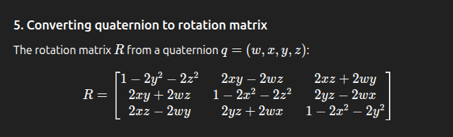
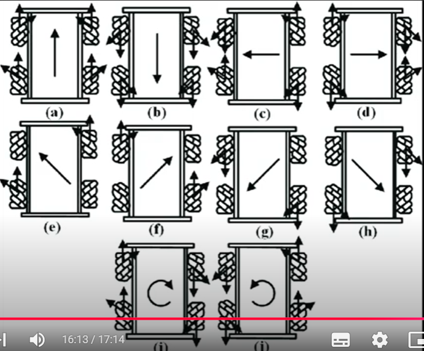

# 🤖 Transformations
A robot must understand its **structure**, **position**, and **environment** to move effectively. 🚀

## 🔄 Transforming Concept
Using **matrices**, you can shift from one perspective to another, transforming a **local frame** into a **global frame** for a broader, unified view. 🌐

This allows you to translate components like **tires** or **arms** from their own world—**point of view**—to a general world encompassing all robotic parts. 🤝

## 📚 Basic Concepts

### 📏 Frames
A **frame** is a coordinate system used to describe objects—it acts like an **eye**. 👁️  
Different coordinates mean **different ways of seeing**, describing the same vectors with varying values. Transforming a vector between frames requires accounting for this "different perspective." 🔍

### 🌍 Local Frame vs. Global Frame
A frame defines how you **see the world**. Every component has its **local frame**, while some systems have a **global frame** overseeing multiple components.

**Local and global frames** are relative to what's observed. For instance:  
- Each human perceives life through their **local frame**—their unique perspective.  
- Satellites observing human interactions (positions and orientations) provide a **global frame** for humanity. 🛰️

**Robotic-wise**:  
Each component, like a wheel or sensor, has its own **local frame**. The observer (e.g., a human) monitoring all robot parts operates in a **global frame**. 🤖

### 🔢 Transformation Order
When transforming between grids using multiple matrix multiplications, **order matters**! For example:  
- **Rotating then translating** differs significantly from **translating then rotating**.  
- *Rotating and moving forward* ≠ *moving forward and then rotating*. 🔄➡️

### 📐 Homogeneous Coordinates
These represent points in space, enabling both **translation** and **rotation** via matrix multiplication. They simplify transformations between coordinate systems. 🧮

### 🌀 Types of Movement—Transformations

1. **Rotation** 🔄  
   Rotates the pre-image around an axis.  
   - All points shift by a set angle from the center (+ for counter-clockwise).  
   - No change in size or shape.  
   - Uses **eigenvectors**.  
   

2. **Reflection** 🪞  
   Flips the pre-image over a line, creating a mirror image.  
   - Same orientation around the line, like orbiting it.  
   - Point (p,q) becomes (q,p).  

3. **Translation** ➡️  
   Slides the pre-image without changing size or shape, only direction.  
   - All points move by the same amount (n units per direction).  
   - Relative positions between points remain constant.  

4. **Dilation** 📏  
   Stretches or shrinks the pre-image.  
   

### 🧭 Coordinate Convention
Uses a **right-handed coordinate system**.  
- The **right-hand rule** determines positive rotation direction around an axis.  
- **X**: Red, **Y**: Green, **Z**: Blue. 🎨

## 💡 Transformation Uses

1. **Making Numbers Meaningful** 📊  
   Translates sensor data for different components.  
   - Ex: A point from a camera is useless to wheels unless transformed into their coordinates. 📸➡️🚗

2. **Chaining Local to Global Motion** 🔗  
   Each joint/link moves in its **local frame**. Combining transforms shows their effect on the environment (**forward kinematics**).  
   - **Static Transformation** 🛠️: Fixed over time (e.g., robot base to Lidar sensor).  
   - **Dynamic Transformation** 🏃: Varies with motion (e.g., camera frame relative to wheel motion changes with wheel direction).  

3. **Sensor Fusion** 🤝  
   Different sensors use different frames. Combining them into one frame improves **accuracy** and detects **faulty sensors**. 🔬

## ➗ Linear Transformation: f(p) = Ap
Follows two rules (parallel lines stay parallel):  
1. **Additive**: T(u+v) = T(u) + T(v)  
2. **Scaling**: T(c.u) = cT(u)  
Includes **reflection**, **rotation**, and **scaling**. 📐

# 🏃 Kinematics
The study of **geometrical motion** of objects, independent of external forces. 🚴

## ➡️ Forward Kinematics
Finds the **position** and **orientation** of the **end-effector** in the workspace. 🌍

1. **Assign Frames to Links** 📍  
   Uses **6 DH parameters** (3 for translation, 3 for rotation; 4 in older models).  
   Frames are ideally placed at **joints** connecting links.

2. **Calculate Adjacent Frame Transformations** 🔄  
   **Tij**: Transformation of link i’s frame relative to frame j.  
   Can be **fixed** or **dynamic**.

3. **Solve for End-Effector (EE)** 🎯  
   If Tee is the end-effector, it’s directly affected by Tee-1 (e.g., T3), with T0 as the base.  
   - Transform from T3 to Tee (T3-ee).  
   - Chain from base to EE: T0-ee = T0-1 × T1-2 × T2-3 × T3-ee.  
   This matrix accounts for all **rotations** and **translations** between joints/links. As the robot moves, matrix parameters update, altering the EE’s effect. 🔧

## ⬅️ Inverse Kinematics
Calculates **joint parameters** given the target **position** and **orientation** of the EE.  

Challenges arise due to zero determinants or non-square matrices. Common methods:  
- **Jacobian Inverse Technique** 🧮: Computes and inverts the Jacobian matrix.  
- **Cyclic Coordinate Descent (CCD)** 🔄: Optimizes joints from end to root to minimize EE-target distance.  

*Research more on this later!* 📖

# 🔢 Maths Diving

## 🧮 Spatial Transformation Matrices

### 💭 Concept
Combines **translation**, **rotation**, and **scaling** into a single **4x4 affine matrix**.  
- Upper-left **3x3**: Rotation (i", j", k" basis vectors).  
- Last column: Translation [a14, a24, a34].  
  
The 3x3 defines **orientation**, while the last column defines **position** in space. 📍

### 📌 Last Row
- **Points**: Have a **1** in the 4th position of the 4th column.  
- **Vectors**: Have a **0**, ignoring translation (only length and direction matter).  
Affine transformation matrices always end with **0 0 0 1** in the last row. 🔢

## 📊 Types of Matrices *[1blue3brown playlist highly recommended!]*

1. **Translation Matrix** ➡️  
   Keeps i", j", k" unchanged, adds tx, ty, tz for translation, and 1 for points.  
     
   

2. **Scaling Matrix** 📏  
   Multiplies i", j", k" by constants to scale vectors.  
   

3. **Rotation Matrix** 🔄  
   Defined by the rotation angle.  
   

## 🧭 Euler Angles & Quaternions
**Euler Angles**: Three angles (Roll, Yaw, Pitch) representing orientation around x, y, z axes. **Order of rotation matters**! 🔄

### ⚠️ Gimbal Lock
When rotating with 3 matrices (yaw, pitch, roll):  
- One matrix may become **redundant** (same result regardless of value).  
- Two matrices may **align or cancel**, reducing independent rotations.  
- Combined rotations may mimic a single rotation.  
*Result*: Loss of a degree of freedom (DOF drops from 3 to 2). 😞

### 🔮 Quaternions
Solves **Gimbal lock**. Describes rotations using an **imaginary vector** and **real angle**.  
- Performs multiple rotations in **one operation** around a unique axis, avoiding Gimbal lock.  
  

## 🔗 Concatenating Transformations
Applying multiple matrices to a point/vector performs sequential transformations.  
- Useful for **debugging** or when **intermediate results** are needed.  
- Preferably, multiply matrices first to create a **single transformation matrix** for efficiency (concatenation/composition). 🛠️

# 📄 Appendix

- **Robot Definitions** 🛠️:  
  - **Links**: Rigid bodies forming the robot’s structure (e.g., arms in Turtlebot).  
  - **Joints**: Movable parts (actuators) enabling motion between links.  
  - **Degree of Freedom (DOF)**: Number of independently moving joints.  
  - **End-Effector**: Final link interacting with the environment.  
  - **Workspace**: Area where the robot operates.  
  - **DH Parameters**: 4–6 parameters (3 translation, 3 rotation) for assigning frames to links.  
  - **Total DOF**: Sum of translational and rotational DOFs.  
  - **Holonomic**: Moves freely in configuration space.  
  - **Non-Holonomic**: Limited by constraints (allowed directions < configuration space directions).

- **Wheel Force Movement** 🚗  
  

- **i", j", k"**: Basis vectors for a 3D coordinate system. 🧮

# 📖 References
- **MIA Sessions** 🎥  
  [YouTube: MIA Session 1](https://www.youtube.com/watch?v=u2AJ8TD0Cgs&list=PLBXdR4DulnPuwS4lbNTM9eF2XWMEGFDKB&index=33)  
  [YouTube: MIA Session 2](https://www.youtube.com/watch?v=7q0E_Q8a6FM&list=PLBXdR4DulnPstl48cLbD9m6cuoJM05_Q3&index=34)  

- **Transformation Benefits** 🌟  
  [Robotisim: How Robotics Depends on Transforms](https://robotisim.com/how-robotics-depends-upon-transforms/)  

- **Linear Transformation** 📐  
  [Medium: Mastering Linear Algebra](https://medium.com/@ebimsv/mastering-linear-algebra-part-4-understanding-linear-transformations-and-their-geometric-363235e0a700)  

- **Forward Kinematics** ➡️  
  [ROS Robotics: Forward Kinematics](https://www.rosroboticslearning.com/forward-kinematics)  

- **Inverse Kinematics** ⬅️  
  [ROS Robotics: Inverse Kinematics](https://www.rosroboticslearning.com/inverse-kinematics)  

- **Transformation Matrices** 🧮  
  [BrainVoyager: Spatial Transformation Matrices](https://www.brainvoyager.com/bv/doc/UsersGuide/CoordsAndTransforms/SpatialTransformationMatrices.html)  
  [Cuemath: Transformations](https://www.cuemath.com/geometry/transformations/)  
  [GeeksforGeeks: Transformation Matrix](https://www.geeksforgeeks.org/maths/transformation-matrix/)  

- **Essence of Linear Algebra** [Escape if short on time!] 📚  
  [YouTube: 3Blue1Brown Playlist](https://www.youtube.com/watch?v=fNk_zzaMoSs&list=PLZHQObOWTQDPD3MizzM2xVFitgF8hE_ab)  

- **Quaternions Intuition** [Still a bit unclear 😅] 🔮  
  [YouTube: Quaternion Intro 1](https://www.youtube.com/watch?v=d4EgbgTm0Bg)  
  [YouTube: Quaternion Intro 2](https://www.youtube.com/watch?v=zjMuIxRvygQ)  
  [Eater: Quaternions](https://eater.net/quaternions/video/intro)  

