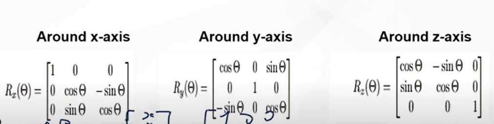
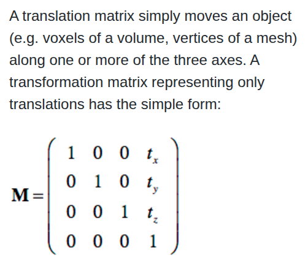
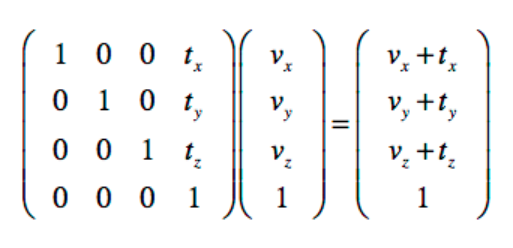
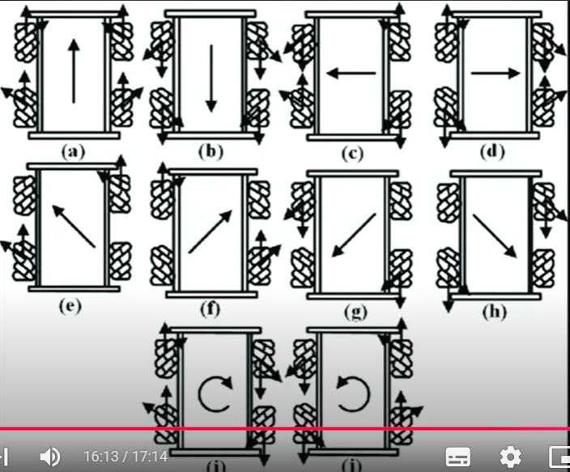

# Transformations
a robot needs to understand its construction , position and the environment around it to move accordingly .

## Transforming concept
using matrices you can transform from one points of view to another point of view , from a local simple frame to a global frame that generalizes and observes better

this transformation allows you to translate tires,arms and other robotic components from their world - point of view - to your general world that contains all those components 

## Basic Concepts
### Frames
a frame is a set of coordinates that's used to describe other things _acts like an eye_
different coordinates _different way of seeing_ describe same vectors using different values  , to transform a vector from one frame to another this "seeing differently" must be taken into consideration

### Local frame vs Global frame
a frame is the way you see the world , every thing has its own local frame > and some of this things will have a global frame over multiple things

local frame and global frame are relative to the thing observed , for example each human lives their live using their local frame - point of seeing things - , satellites that observe all the humans and the overall interaction(their positions and orientation) between all those humans provide a humans' global frame 

`robotic wise`
each component has its own way to see the world -local frame- , the human observing all the robot components and the en

### Transforming order
while transforming from a grid to a grid that requires more than 1 matrix multiplication (for ex rotating then translating will differ widely from translating then rotating)
_rotating then moving relatively forward will differ from moving forward then rotating_

### Homogeneous co coordinates
used to represent points in space in a way that allows both translation and rotation to be applied using matrix multiplication
makes it easier to transform between different coordinates

### Types of movement -transformations-

1. Rotation , rotates or turn the pre-image around an axis 
    rotates all points a certain difference from the center of rotation (+ if counter clockwise)
    No change in size or shape.
    Done by using Eigen vectors
    

2. Reflection , Flips the pre-image about a line and produces a mirror-image
    Same orientation around this line -like the photo orbiting around this line.
    every point (p,q) is transformed into a (q,p) point

3. Translation 
    Slides or moves the pre image , no changes in size or shape but changes the direction 
    All points will go through the same effect (moving n units in each direction)
        due to that all points relative position to other points is constant 

4. Dilation , Stretches or shrinks the pre-image 

### Coordinates Convention 
Right-handed coordinate system 
the right hand rule is used to determine the direction of positive rotation around an Axis
X is drawn in Red , Y in Green , Z in Blue

## Transformation Uses 
1. Makes number meaningful among parts
    interpreting the information received by each sensor and translating them to different components , -> ex a point measured by camera is useless for the wheels unless its transformed in their coordinates 
2. Chain local motions into global motion
    Each joint/link moves in its own local way. 
    Composing transforms tells you how all that is effecting the environment (forward kinematics).
    - Static transformation[Fixed Spatial Relation] :
        Constant over time : between components whose frames are relatively constant to each other , ex -> the relationship between the robot's base and the Lidar sensor 
    - Dynamic Transformation :
        defines the spatial relationship between components that are in motion relative to each , ex -> camera frame reporting to wheel linear motion frame will differ according to where the "front" of the wheels is pointing.
3. Sensor fusion 
    different frames have different frames , combining some sensors in one frame to compare,fuse and filter will help in getting more accuracy and detecting faulty sensors

## Linear Transformation f(p) = Ap
Linear transformation follows 2 Rules , due to parallel lines remaining in parallel after linear transformation
    1. Additive , T(u+v) = T(u) + T(v)
    2. T(c.u) = cT(u)

includes reflection , rotation and scaling

# Kinematics
kinematics is the study of geometrical aspects motion of objects independent of external forces

## Forward kinematics
Forward kinematics is finding the position and orientation of the end-effector in the operational workspace

1. Assigning frames to the links
using the 6 (4 in older models) DH parameters _3 for translation and 3 for rotation_
those links are preferred to be located at joints with other links.

2. Calculating the transformation of the adjacent frames
Tij is the transformation of link i frame wrt frame j 
this transformation matrix can be fixed , or dynamically changing

3. solving the input resulting in EE (output)
Assuming Tee is the end effector link , Tee is effected directly by Tee-1 (for ex T3)  and (To being base)
first you get the Tee that's affected directly from T3 by transforming between T3 and Tee , T3-ee
To follow from base to Tee (following a chain rule , from Tee to T3 , from T3 to T2 and like that)

T0-ee = T0-1 x T1-2 x T2-3 x T3-ee > the full transformation matrix from the base frame to the end effector frame (taking into considerations all the rotations and translations of every joint and link in between)
as the robot moves the parameters in those Matrices is updated , resulting in a different end effector effect

## Reverse Kinematics 
Same concept of the forward matrix , given the target position and 
orientation of the ee , you calculate the joint parameters

Some methods are used because the inverse is not directly calculated , zero determinant or non square matrix

- Jacobian inverse technique is the most used technique to solve this problem , by computing the jacobian matrix and inverting it

- Cyclic co-ordinate descent
CCD solves the problem through optimization , looping through the joints from end to root , we optimize each joint to get the ee as close to the target as possible

__Research more of this topic later__

# Maths diving 

## Spatial Transformation Matrices `Math and construction`

### Concept
any combination of translation,rotations and scaling can be  combined by a single 4x4 affine matrix
where upper left 3x3 represents the rotation(i" and j" and k" values in this coordinates)
,and the last  column represents a translation [a14 , a24, a34]

if this 4x4 matrix represents a coordinates , the first 3x3 represents the orientation , while the last column represents a vector or points in this space

### last row
to distinguish between points and vectors , points have a 1 in the 4th position of 4th column.
while vectors have a 0 which removes the translation operation  - A vector doesn't care where it starts , what matters is its length and direction- therefore translation has no effect on it _useless_
(the convention is that it starts from origin but not necessary)

for an affine transformation matrix , the final row of the matrix is always 0 0 0 1

## Types of Matrices [1blue3brown playlist is highly suggested]
  1. Translation Matrix
     by keeping the i" , j" , z" to their original values and inserting tx , ty , tz to represent the translation and 1 because you're moving this points along one or more coordinates
    
    

  2. Scaling Matrix
     by multiplying i" , j" , k" by constants to represent a new system where vectors are scaled by those vectors
     

  3. Rotation Matrix
     Rotation about coordinates is specfied by the angle
     
     

## Euler angles and Quaternions
  Eular angles are a set of three angles that represent the orientations in space , Each angle represents a rotation around of the three orthogonal axes (x,y,z)(Roll,Yaw,Pitch) -> the order in which you apply the transformation to each angle surely matters

### Gimbel Lock
  To put it simply, when rotating around 3 axes you multiply 3 rotation matrices (e.g., yaw, pitch, roll).
  
  For some special values :
    One of the matrices becomes redundant → the result is the same no matter its value.
    Two of the matrices may align or cancel out, so they no longer represent two different rotations.
    Or, two combined with the third produce the same effect as just one rotation.

  > What all these cases have in common is that rotation is no longer happening around 3 independent axes. One or more transformations become redundant, reducing the degrees of freedom (DOF) from 3 down to 2.

### Quaternions  
  is a method to solve the Gimbel lock issue , they offer an alternative way to describe rotations.
  They're similar to complex numbers with the an imaginary vector part and a real angel part
  multiple rotations are done using only 1 operation around a unique imaginary axe, therefore doesn't go through the problems of gimble lock  
  
  

## Concatenating Transformations
  multiplying a point or a vector by multiple matrices will apply multiple transformations, those transformations can be sequentially __in order to debug results after every transformation__ or __if those mid_way results are needed__
  but generally its preferable to first multiply all matrices together to produce a single matrix that contains all transformations , then apply it at once .
  this manner is known as concatenation or composition of matrice

# Appendix 
- Robot Definitions  :

    links   : rigid bodies that gives the robot structure _robot arms in turtlebot_

    Joints : are the movable parts (actuators) which is responsible for the relative motion between links
    _the joints that moved the arms up ,down,left and right_

    Degree of freedom : Number of joints that can move independently 

    End-Effector : that last link that affects the environment

    Work-space : The space in which your robot works

    DH parameters : 4 parameters that are used to assign frames to links of a robot 
    using 6 parameters (3 for translation and 3 for rotation)

    Total DOF - sum of translational and rotational degrees of freedom

    Holonomic : moves in any direction in the configuration space

    Non - Holonomic : has some constraints , n_directions_allowed < n_cs_directions

- Movement due to each wheel force

- i" , j" , k" represenets the basis for a 3 coordinates system 
    

# References
`MIA Sessions`
https://www.youtube.com/watch?v=u2AJ8TD0Cgs&list=PLBXdR4DulnPuwS4lbNTM9eF2XWMEGFDKB&index=33

https://www.youtube.com/watch?v=7q0E_Q8a6FM&list=PLBXdR4DulnPstl48cLbD9m6cuoJM05_Q3&index=34

`transformation benefits`
https://robotisim.com/how-robotics-depends-upon-transforms/

`Linear transformation`
https://medium.com/@ebimsv/mastering-linear-algebra-part-4-understanding-linear-transformations-and-their-geometric-363235e0a700

`Forward Kinematics`
https://www.rosroboticslearning.com/forward-kinematics

`Reverse Kinematics`
https://www.rosroboticslearning.com/inverse-kinematics

`Transformation matrices`
https://www.brainvoyager.com/bv/doc/UsersGuide/CoordsAndTransforms/SpatialTransformationMatrices.html

https://www.cuemath.com/geometry/transformations/

https://www.geeksforgeeks.org/maths/transformation-matrix/

`Essence of linear algebra` [Escape if low on time]
https://www.youtube.com/watch?v=fNk_zzaMoSs&list=PLZHQObOWTQDPD3MizzM2xVFitgF8hE_ab

`Quaternions intuition` [i didn't understand clearly T-T]
https://www.youtube.com/watch?v=d4EgbgTm0Bg
https://www.youtube.com/watch?v=zjMuIxRvygQ
https://eater.net/quaternions/video/intro