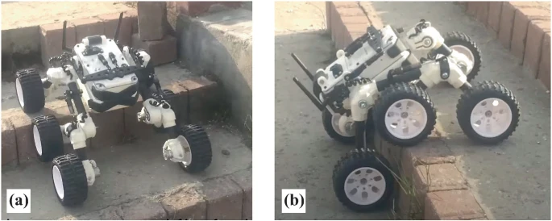

# 🤖 R2 – Tall Robot  
- **Fully automated**  
- **Scroll handling**:  
  - Specific scrolls are lifted only by R2.  
  - Identified using a **camera + computer vision** algorithms to detect the **pattern** on the box.  
  - Decides whether to lift or leave it alone.  
- **Mobility**:  
  - Moves through the **forest** using **6 wheels** to move forward.  
  - Can climb **up or down stairs**.  
  - 
  - .jpg>)
  -   
  - Cad_design : (https://share.google/images/HY1TGdr2MmdwHx0Hy)
  - Research to move fast while being able to move up stairs :
    https://share.google/images/O4UklNizP5SGqz3HP
    
- **Placement rules**:  
  - Can only place scrolls on the **middle** and **top lines**.  
  - Uses camera or coordinates to detect **top** and **bottom** rows. 

---

# 🤖 R1 – Agile Robot  
- **Manually controlled**  
- **Scroll handling**:  
  - Specific scrolls are lifted only by R1.  
- **Mobility**:  
  - Moves around the **lines surrounding the forest**.  
- **Placement rules**:  
  - Can only place scrolls on the **bottom line**.  

---

# 🗺️ Map Overview  
1. **Martial Club** → Start zone, new weapons.  
2. **Meihua Forest** → Area where both robots navigate. Consists of **8 kung fu scrolls**.  
3. **Arena** → Entry via ramps, weapons are used here.  

---

# 🎮 Game Rules  
- Both bots must **assemble weapons** in the start zone.  
- Each team can **knock down the scrolls** of the other team.  

---

# 📡 R1 ↔ R2 Communication  
- Communication uses a **laser** mounted on top of the **R1 sensor**.  
- Different **laser colors** = specific commands for R2.  
- R2 has a **360° camera** that detects the laser color, then moves to a **relative position** to R1 (center of R1).  
- Depending on the signal (laser or LED color), R2 performs actions.  
- 
- 

---

# 🛠️ Weapon Assembling  
- R2 detects the **weapon held by R1**.  
- Moves to a **relative position** to align with the rest of the weapon.  
- Assembles the weapon with R1.  

---

# ⚡ Boost Mode  
- R1 gives a **boost to R2** to reach the top lines.  
- R2 moves **above R1** (relative position **0, 0, +Z**).  
- From this position, R2 can **fill the top rows**.  
- .jpg>)

🎥 Demo: [Video link](https://youtu.be/rpJ2FdiYuJk?si=ulbkg5XY08obHkiI)  
