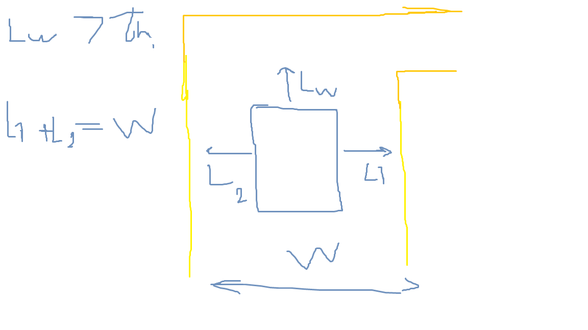
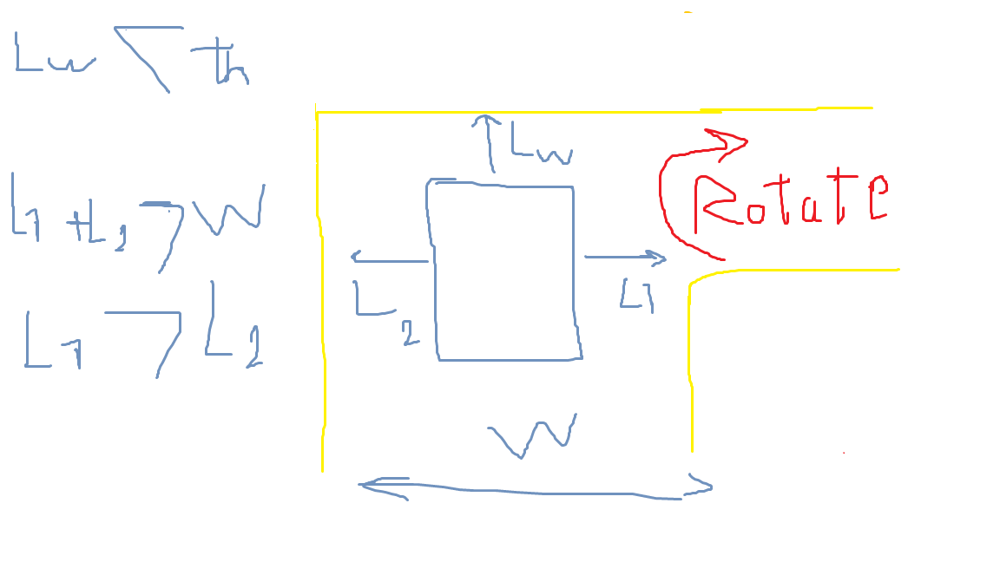
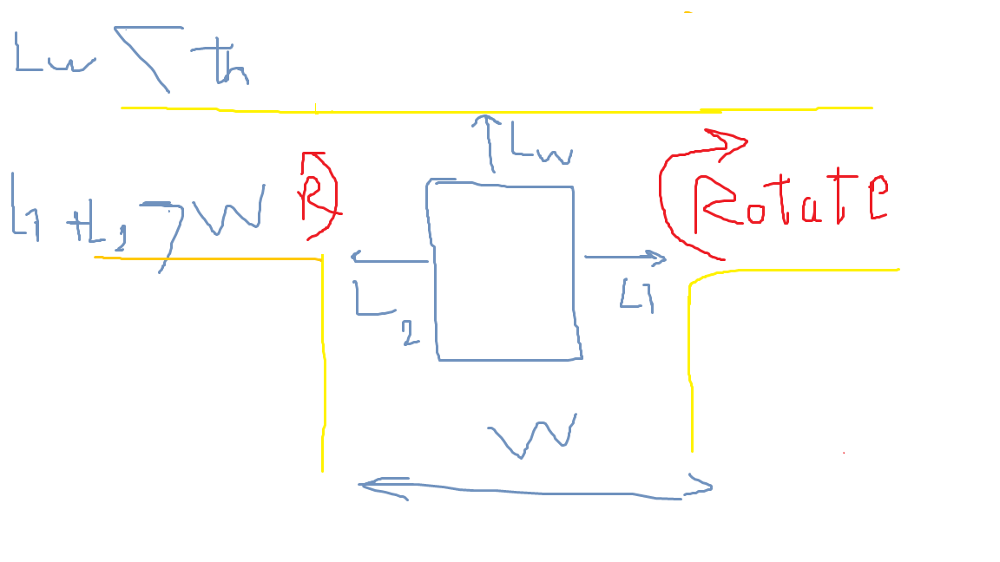
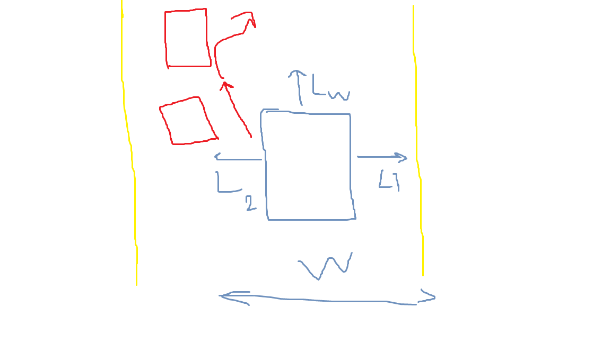
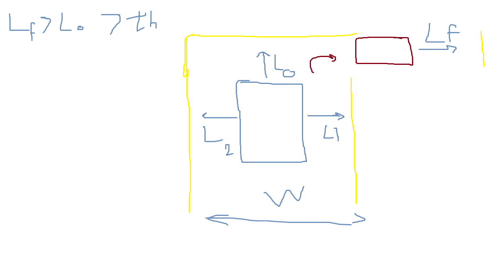

# Mini Tasks

1. "Walls detection"    
    `input : ` > reading of the ultrasonic sensors

    Using the readings from the ultrasonics process them to decide if its moving through a corridor , taking a turn or deciding if its an intersection,
    
    if the reading of the front sensor is above a certain threshold and the reading of left sensor + right sensor = width of maze -> its moving through a corridor
    

    if the reading of one of the sensors is higher than then the other one (L1 + L2 > W) then its a one way turn 
    

    if the readings of both sensors are higher then its an intersection , you can move both ways
    

    `output : `  publish to /walls_detection
    intersection 
    turn
    corridor 
    or 0 , 1 , 2 where each number stands for a status

2. "Robot centralizing"
    `input : ` > subscribes to walls/detection
                  > subscribes to /ultrasonics and /Yaw

     moving through a corridor ,its better to centralize the robot using by moving with bias till ultrasonic readings are equal or /yaw = 0
     

    `output : ` publishes goal distances to /PID_US

3. "Taking a Turn"
    `input : ` > subscribes to  /walls_detection  
                  >                        /ultrasonics 
    rotates the robot till the readings of the front ultrasonic is changed from d > vth too d > vth + bias 
    

    `output : ` publishes goal distances to /PID_US

4. "Letter detection" 
    `input : ` > /walls_detection
                  > /camera_feed
    activates the letter detection model to identify the letter 

    `output : ` appends the letter(if its green) to the five letters msg

5. "intersection choosing" [ Preferred to be a  Service]
    `input : ` > /walls_detection
                  > /camera_feed
    
    activates the direction detection model to detect the direction at intersections

    -> the Client is next step

    `output : ` a server that returns left or right

6. "Intersection moving"
    `input : ` > / Client of /intersection_choosing

   `output : ` uses the service to rotate in a specific direction [same logic as take_turn]

7. "PID"
    `input : `> /PID_US
    control the movement using PID concepts
    `output : ` cmd/vel

8. "Integration"
    the whole system must be integrated together safely to ensure that all the topics are published by 1 publisher at a time

