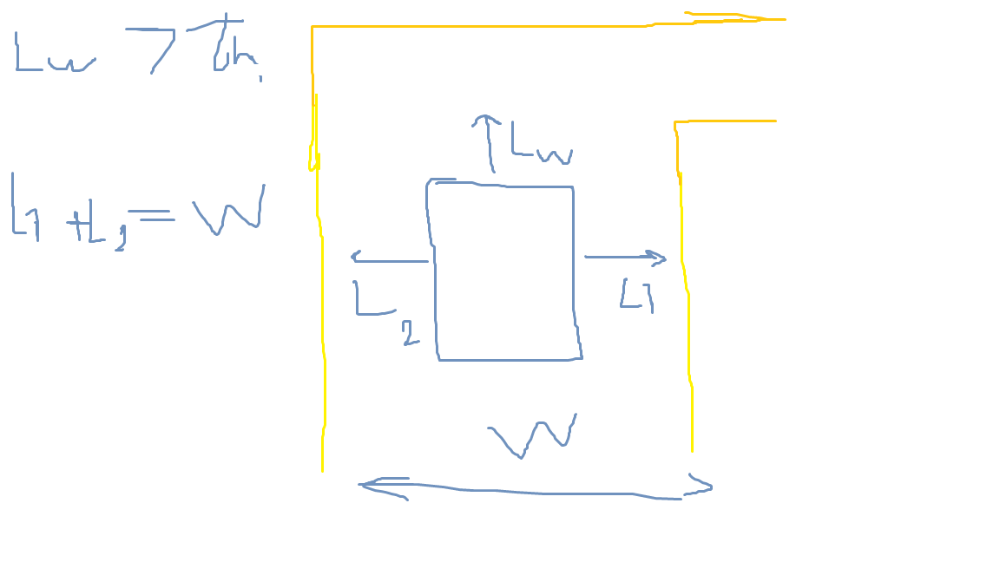
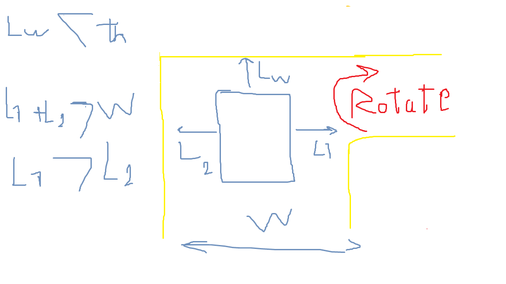
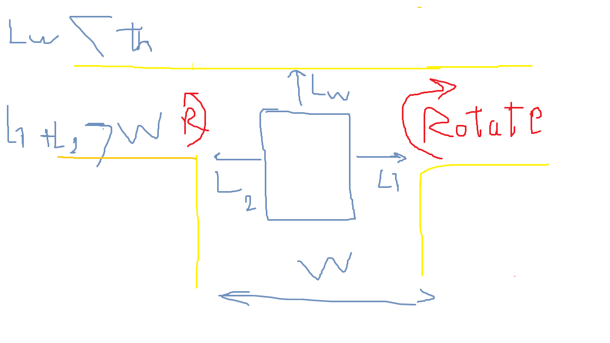
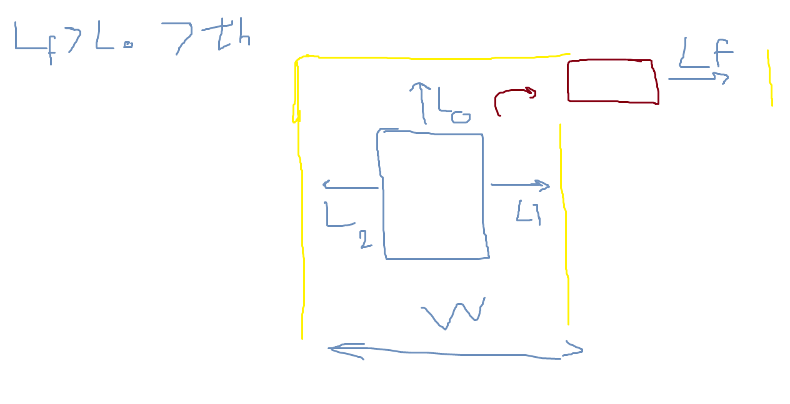

# 🛠️ Mini Tasks  

---

### 1. 🧱 Walls Detection  
**Input:**  
- Readings of the ultrasonic sensors  

**Logic:**  
- If **front sensor > threshold** and **left + right = width of maze** → Moving through a **corridor**  
    

- If **one side sensor is higher than the other** (L1 + L2 > W) → **One way turn**  
    

- If **both side sensors are higher** → **Intersection**  
    

**Output:**  
- Publish to **/walls_detection**:  
  - `intersection`  
  - `turn`  
  - `corridor`  
  - or `0, 1, 2` where each number stands for a status  

---

### 2. 🎯 Robot Centralizing  
**Input:**  
- Subscribes to **/walls_detection**  
- Subscribes to **/ultrasonics** and **/yaw**  

**Logic:**  
- While moving through a corridor → Centralize robot by adjusting bias until **ultrasonic readings are equal** or **yaw = 0**  
    

**Output:**  
- Publish goal distances to **/PID_US**  

---

### 3. ↩️ Taking a Turn  
**Input:**  
- Subscribes to **/walls_detection**  
- Subscribes to **/ultrasonics**  

**Logic:**  
- Rotate robot until front ultrasonic changes from **d > vth** to **d > vth + bias**  
    

**Output:**  
- Publish goal distances to **/PID_US**  

---

### 4. 🔤 Letter Detection  
**Input:**  
- Subscribes to **/walls_detection**  
- Subscribes to **/camera_feed**  

**Logic:**  
- Activate letter detection model → identify letter  

**Output:**  
- Append letter (if green ✅) to the **five letters msg**  

---

### 5. 🔀 Intersection Choosing (Preferred as a Service)  
**Input:**  
- Subscribes to **/walls_detection**  
- Subscribes to **/camera_feed**  

**Logic:**  
- Activate direction detection model → detect direction at intersections  
- Client = next step  

**Output:**  
- Server returns **left** or **right**  

---

### 6. 🧭 Intersection Moving  
**Input:**  
- Client of **/intersection_choosing**  

**Output:**  
- Use service to rotate in a specific direction (same logic as **Taking a Turn**)  

---

### 7. ⚖️ PID  
**Input:**  
- Subscribes to **/PID_US**  

**Logic:**  
- Control movement using **PID concepts**  

**Output:**  
- Publish to **cmd/vel**  

---

### 8. 🔗 Integration  
- Ensure whole system is integrated safely  
- All topics must be published by **only 1 publisher at a time**  
